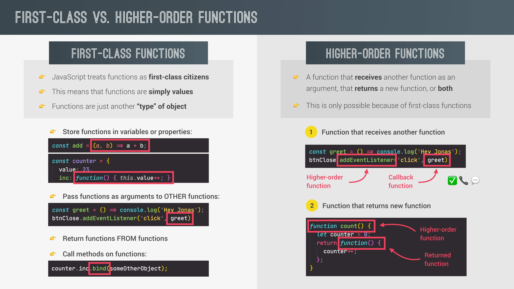

# A Closer Look at Functions.

## 1. Default Parameters

함수의 파라미터에는 값이 전달되지 않을시에 사용할 기본값을 설정할 수 있다.

es6 이전에는 아래와 같이 shortcircuting을 활용해서 defalut parameter를 사용했다. 파라미터로 값이 전달되지 않으면 값이 undefined가 되는것을 이용한 것이다.

```js
const bookings = [];

const createBooking = function (flightNum, numPassanger, price) {
  numPassanger = numPassanger || 1;
  price = price || 199;

  const booking = {
    flightNum,
    numPassanger,
    price,
  };
  console.log(booking);
  bookings.push(booking);
};

createBooking("LH123"); // {flightNum: "LH123", numPassanger: 1, price: 199}
```

es6이후에는 아래처럼 간단하게 default 값을 설정할 수 있다.

```js
const bookings = [];

const createBooking = function (flightNum, numPassanger = 1, price = 199) {
  const booking = {
    flightNum,
    numPassanger,
    price,
  };
  console.log(booking);
  bookings.push(booking);
};

createBooking("LH123"); // {flightNum: "LH123", numPassanger: 1, price: 199}
```

또한 계산된 값을 default 값으로 설정할 수도 있다.

```js
const bookings = [];

const createBooking = function (
  flightNum,
  numPassanger = 1,
  price = 199 * numPassanger
) {
  const booking = {
    flightNum,
    numPassanger,
    price,
  };
  console.log(booking);
  bookings.push(booking);
};

createBooking("LH123"); // {flightNum: "LH123", numPassanger: 1, price: 199}
createBooking("LH123", 2, 800); // {flightNum: "LH123", numPassanger: 2, price: 800}
createBooking("LH123", 5); // {flightNum: "LH123", numPassanger: 5, price: 995}
```

만약 여러개의 파라미터중 값을 전달하고 싶지 않은 파라미터가 존재한다면 아래와같이 함수를 호출하면 된다.

```js
createBooking("LH123", undefined, 1000); // {flightNum: "LH123", numPassanger: 1, price: 1000}
```

## 2. How Passing Arguments Works: Value vs. Reference

자바스크립트에서 primitive와 reference는 함수에 전달될 때 다른 양상을 보인다. 아래 코드를 살펴보자.

```js
const flight = "LH234";
const jonas = {
  name: "Jonas Schmedtmann",
  passport: 24739479284,
};

const checkIn = function (flightNum, passenger) {
  flightNum = "Lh999";
  passenger.name = "Mr. " + passenger.name;

  if (passenger.passport === 24739479284) {
    alert("Check in");
  } else {
    alert("Wrong passport!");
  }
};

checkIn(flight, jonas); // alert : Check in
console.log(flight); // LH234
console.log(jonas); // {name: "Mr. Jonas Schmedtmann", passport: 24739479284}
```

checkIn 함수의 파라미터를 통해 전달되고 함수 안에서 값을 변경한 문자열 flight는 함수 밖에서 그 값이 변경되지 않았지만 객체 jonas의 경우는 name 프로퍼티가 변경된 것을 알 수 있다. 이는 마치 다른 언어의 call-by-value, call-by-reference 각각의 결과와 동일하다. 자바스크립트에서 위와같이 함수에 값을 전달하는 과정은 아래와 같다고 볼 수 있다.

```js
const flightNum = flight;
const passenger = jonas;
```

우리는 이미 primitive type과 reference type 간의 차이점을 알고 있다. 위와같은 상황에서 flightNum의 값을 변경하더라도 그것이 flight에는 반영이 되지 않지만 passenger의 프로퍼티를 변경하는 것은 jonas에 반영이 된다. 따라서 함수의 argument로써 reference type을 사용할때는 주의가 필요하다.

위의 과정을 살펴보면 jonas 객체는 함수가 호출될 때 call-by-reference가 이루어진듯 하지만 사실 자바스크립트에는 call-by-value만이 존재한다. 정확히 말하자면 자바스크립트는 함수에 reference가 아닌 reference(객체가 저장된 힙 메모리 주소)를 포함하고 있는 '값'을 파라미터에 넘겨주기 때문이다.

## 3. First-Class and Higher-Order Functions

JavaSrcipt의 함수는 first-class function으로 단순히 값이다. 또한 함수는 객체의 또다른 유형이다.

### 3-1. 함수가 값이기에 가능한 것들.

- 함수를 변수에 할당하거나 object의 프로퍼티로 사용할 수 있다.

- 함수를 다른 함수의 arguments로서 전달할 수 있다.

- 함수에서 함수를 반환할 수 있다.

### 3-2. Higher-Order Functions

Higher-Order Functions은 argument로 다른 함수를 전달받는 함수 또는 새로운 함수를 반환하는 함수를 의미한다. 이때 argument로 전달되는 함수를 callback function이라고 한다. 왜냐하면 callback function은 Higher-Order Function에 의해서 나중에 호출되기 때문이다.



## 4. Functions Accepting Callback Functions

위에서도 말했듯이 함수에 arguments로 함수를 전달하면 전달되는 함수는 callback function이고 전달받는 함수는 higher-order function이라고 한다. JavaScript에서 callback function은 매우 중요한 컨셉이다. 많은 built-in function들에 이 컨셉이 적용되어있다. 아래는 callback function 활용의 예이다.

```js
const oneword = function (str) {
  return str.replace(/ /g, "").toLowerCase();
};

const upperFirstWord = function (str) {
  const [first, ...others] = str.split(" ");
  return [first.toUpperCase(), ...others].join(" ");
};
//Higher-order function
const transformer = function (str, fn) {
  console.log(`Original string : ${str}`);
  console.log(`Transformed string : ${fn(str)}`);
  console.log(`Transformed by : ${fn.name}`);
};

transformer("JavaScript is the best!", upperFirstWord);
// Original string : JavaScript is the best!
// Transformed string : JAVASCRIPT is the best!
// Transformed by : upperFirstWord

transformer("JavaScript is the best!", oneword);
// Original string : JavaScript is the best!
// Transformed string : javascriptisthebest!
// Transformed by : oneword
```

### 4-1. callback function의 장점.

- 코드를 보다 재사용성, 상호 연결성이 있도록 분할할 수 있다.

- 추상화가 가능하도록 해준다.

### 4-2. 추상화란?

추상화란 기본적으로 코드 구현의 세부사항을 숨기는 것. 우리는 추상화를 통해 코드의 세부사항을 낮은 수준의 추상적 단계에 넘겨주고 문제에 대해 더 높은 추상적 단계에서 생각할 수 있게 된다.

```js
const oneword = function (str) {
  return str.replace(/ /g, "").toLowerCase();
};

const upperFirstWord = function (str) {
  const [first, ...others] = str.split(" ");
  return [first.toUpperCase(), ...others].join(" ");
};
//Higher-order function
const transformer = function (str, fn) {
  console.log(`Original string : ${str}`);
  console.log(`Transformed string : ${fn(str)}`);
  console.log(`Transformed by : ${fn.name}`);
};
```

위의 예시에서 우리는 문자열 변환 코드를 oneword, upperFirstWord 함수로 추상화 하였기 때문에 transformer 함수에서 문자열이 어떻게 변환이 되는지는 신경쓸 필요가 없어졌으며 그저 추상화된 함수를 사용하면 되게 되었다. 즉, 우리는 연산과정을 낮은 수준의 추상적 단계(oneword, upperFirstWord)로 넘기고 높은 수준의 추상적 단계(transformer)에서 생각할 수 있게 된 것이다.

## 5. Functions Returning Functions.

함수는 함수를 반환할 수 있다. 예시는 아래와 같다.

```js
const greet = function (greeting) {
  return function (name) {
    console.log(`${greeting} ${name}`);
  };
};

const greeterHey = greet("Hey");

greeterHey("Jonas"); // Hey Jonas
greeterHey("Steven"); // Hey Steven

greet("Hello")("Jonas"); // Hello Jonas
```

위 예시를 보면 낯설고 불필요해 보일 수 있지만 함수형 프로그래밍 패러다임에 있어서는 유용하다.

아래와 같이 화살표 함수로도 작성이 가능하다.

```js
const greet = (greeting) => (name) => console.log(`${greeting} ${name}`);
```

## 6. The call and apply Methods

### 6-1. call method

함수의 call 메소드를 통해서 함수내에서 this 키워드가 어떤 대상을 가리키게 할 지 설정할 수 있다.

아래와 같이 lufthansa, eurowings 객체가 있다고 할 때, lufthansa의 book 메소드를 book 변수에 할당한 후 eurowings에서도 재사용 할 수 있도록 하려면 어떻게 해야할까?

```js
const lufthansa = {
  airline: "Lufthansa",
  iataCode: "LH",
  booking: [],
  // book : function(){},
  book(flightNum, name) {
    console.log(
      `${name} booked a seat on ${this.airline} flight ${this.iataCode} ${flightNum}`
    );
    this.booking.push({ flight: `${this.iataCode} ${flightNum}`, name });
  },
};

const eurowings = {
  airline: "Eurowings",
  iataCode: "EW",
  booking: [],
};

const book = lufthansa.book;

// this 키워드가 undefined를 가리키므로 에러!
// book(23, 'Sarah Williams');
```

call 메소드를 이용하면 book 함수의 this 키워드가 eurowings를 가리키도록 할 수 있다. call 메소드의 첫번째 argument는 this 키워드가 가리킬 객체, 나머지는 해당 함수의 arguments를 전달한다.

```js
book.call(eurowings, 23, "Sarah Williams"); // Sarah Williams booked a seat on Eurowings flight EW 23
console.log(eurowings); // eurowings의 booking 배열을 확인해보면 요소가 book 함수의 call 메소드를 통해 요소가 추가된것을 알 수 있다.
```

### 6-2. apply method

apply 메소드는 기본적으로 call 메소드와 같은 기능을 하지만 함수의 arguments로 배열을 받는다는 차이점이 있다

```js
const swiss = {
  airline: "Swiss Air Line",
  iataCode: "LX",
  booking: [],
};

const flightData = [583, "George Cooper"];

book.apply(swiss, flightData);
console.log(swiss);
```

하지만 모던 자바스크립트에서 apply는 잘 사용하지 않는다. spread 연산자를 통해 call 메소드를 apply 메소드처럼 사용할 수도 있다.

```js
book.call(swiss, ...flightData);
```

## 7. The bind Method

call과 apply 말고도 bind 메소드로도 this 키워드가 가리킬 대상을 지정할 수 있다. bind가 위의 두 메소드와 다른 점은 this 키워드가 지정된 새로운 함수를 반환한다는 것이다. 메소드의 argument로 this가 가리킬 대상만 지정하거나, 함수의 parameter를 미리 세팅할수도 있다.

```js
// this가 가리킬 대상이 지정된 함수를 반환
const bookEW = book.bind(eurowings);
const bookLH = book.bind(lufthansa);
const bookLX = book.bind(swiss);

bookEW(76, "Steven Williams"); // Steven Williams booked a seat on Eurowings flight EW 76

// this가 가리킬 대상을 지정하고, book 함수의 flightNum 파라미터를 23으로 고정한 함수를 반환.
const bookEW23 = book.bind(eurowings, 23);

bookEW23("Jonas Schmedtmann"); // Jonas Schmedtmann booked a seat on Eurowings flight EW 23
bookEW23("Martha Cooper"); // Martha Cooper booked a seat on Eurowings flight EW 23
```

### 7-1. bind 메소드와 이벤트리스너

아래와 같이 코드를 작성했다고 하자. 아래의 클릭 이벤트를 발생시키면 this가 lufthansa가 아닌 dom 요소를 가리킨다는 것을 알 수 있다. 따라서 원하는 결과를 얻지 못한다.

```js
//with Event Listeners
lufthansa.planes = 300;
lufthansa.buyPlane = function () {
  console.log(this);
  this.planes++;
  console.log(this.planes);
};

//이벤트 핸들러 함수의 this는 항상 자신이 붙여진 dom 요소를 가리킨다. 따라서 클릭시 <button class="buy">Buy new plane 🛩</button>과 NAN 출력.
document.querySelector(".buy").addEventListener("click", lufthansa.buyPlane);
```

이 때, bind 메소드를 활용하면 this가 lufthansa를 가리키도록 할 수 있고, 원하는 결과를 얻을 수 있다.

```js
document
  .querySelector(".buy")
  .addEventListener("click", lufthansa.buyPlane.bind(lufthansa));
```

### 7-2. Partial application

bind 메소드는 아래와 같이 활용하기도 한다.

```js
const addTax = (rate, value) => value + value * rate;
console.log(addTax(0.1, 200)); // 220

const addVAT = addTax.bind(null, 0.23);
// addVAT = value => value + value * 0.23;
console.log(addVAT(100)); // 123
```

this 키워드를 사용하지 않으므로 null을 가리키도록 하고, addTax의 rate 파라미터를 0.23으로 지정한 새로운 함수를 반환하여 addVAT 함수를 만들었다. 이런 활용은 default parameter를 지정하는 것과 다를것이 없어 보이지만, 새로운 함수를 만들어낸다는 점에서 default parameter를 지정하는 방식과는 차이가 있다.

## 8. Immediately Invoked Function Expressions (IIFE)

함수를 재사용하지 않고 오직 한번만 실행하는 방법. async/await에 사용된다.

```js
(function () {
  console.log("this will never run again");
  const isPrivate = 23;
})();

// console.log(isPrivate) // error

(() => console.log("this will never run again"))();
```

## 9. Closures

아래와 같이 함수 안에 내부함수가 정의 되었을 때, 외부함수의 실행컨텍스트가 콜스택에서 제거 되더라도 내부함수가 외부함수의 환경(스코프)을 기억하여 스코프 체인을 통해 그 환경(스코프)에 접근이 가능하게끔 하는 것을 클로저라고 한다.

```js
const secureBooking = function () {
  let passengerCount = 0;

  return function () {
    passengerCount++;
    console.log(`${passengerCount} passengers`);
  };
};

const booker = secureBooking();

booker(); // 1 passengers
booker(); // 2 passengers
booker(); // 3 passengers
```

다른 예시들을 보자. 아래 예시를 보면 꼭 새로운 함수를 반환하는 것이 아니라 함수를 정의하고 할당하더라도 클로저가 적용되는 것. 즉, 반환을 하든 할당을 하든 함수가 정의될 때 클로저가 적용된다는 것을 알 수 있다.

```js
let f;

const g = function () {
  const a = 23;
  f = function () {
    console.log(a * 2);
  };
};

const h = function () {
  const b = 777;
  f = function () {
    console.log(b * 2);
  };
};

g();
f(); // 46 출력.
console.dir(f); // scope의 closure를 확인해보면 {a : 23}이 있음.

h();
f(); // 1554 출력.
console.dir(f); // scope의 closure를 확인해보면 {b : 777}이 있음.
```

아래 예시는 setTimeout 함수를 사용한 예시이다. 결과적으로는 boardPassengers 함수를 실행하면 setTimeout 함수의 argument로 전달된 콜백 함수가 wait \* 1000 ms 후에 실행된다. 이때 setTimeout 함수와는 별개로 boardPassengers 함수는 먼저 실행을 마치게 되고 실행 컨텍스트가 콜스택에서 제거된다. 이때 setTimeout 함수의 argument로 주어진 콜백 함수는 클로저가 적용되어 n, perGroup 변수에 접근이 가능하다. 한가지 더 살펴봐야할 부분은 클로저는 scope chain보다 우선순위가 높다는 것이다. 아래 예시를 보면 global scope에 perGroup 변수가 있지만, setTimeout의 콜백 함수는 global scope에서 실행되지만 boardPassengers의 perGroup 변수를 사용하게 된다.

```js
const boardPassengers = function (n, wait) {
  const perGroup = n / 3;

  setTimeout(function () {
    console.log(`We are now boarding all ${n} passengers`);
    console.log(`There are 3 groups, each with ${perGroup} passengers`);
  }, wait * 1000);

  console.log(`Will start boarding in ${wait} seconds`);
};

const perGroup = 1000;
boardPassengers(180, 3);
```
