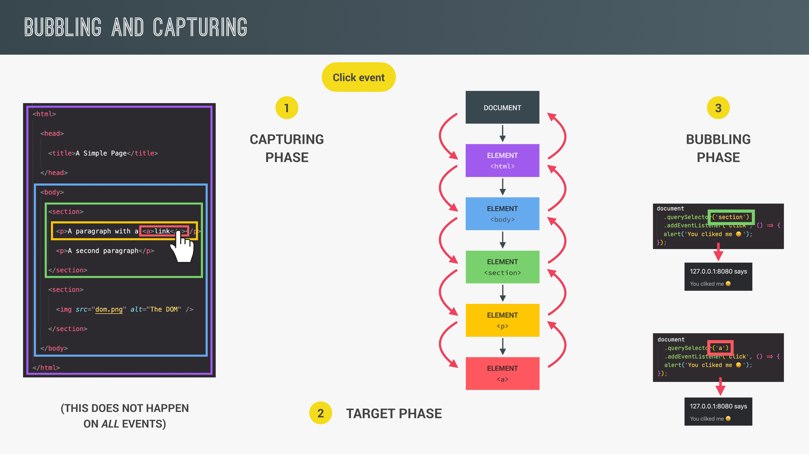

# Advanced DOM and Events

## 1. How the DOM Really Works

### 1-1. What is the DOM?

DOM은 기본적으로 자바스크립트와 브라우저 사이의 인터페이스이다. 조금 더 자세히 말하면 브라우저가 렌더링 과정에서 HTML 문서를 파싱한 것이라고 할 수 있다.

DOM에 대한 특징을 몇가지 설명한다면 아래와 같다.

- 자바스크립트가 브라우저와 상호작용 할 수 있도록 해준다.

- 자바스크립트로 html 요소를 생성,수정,삭제할 수 있으며 스타일, 클래스, 속성에도 접근이 가능하다. 이벤트를 감지하고 반응할 수 있다.

- HTML문서로부터 우리가 상호작용 할 수 있는 DOM 트리가 생성된다.

- DOM은 DOM 트리와 상호작용 하는데에 사용되는 수많은 메소드와 프로퍼티를 포함하고 있는 복잡한 API이다.

### 1-2. DOM Tree

DOM 트리의 모든 노드는 자바스크립트에서 객체로 표현된다. 노드에는 여러 하위 타입이 있는데, 이는 Element, Text, Comment, Document 등이다. 이 덕분에 html의 모든 내용이 DOM에 포함될 수 있다.

- Element : HTML 태그 요소. Element 노드에는 유용한 프로퍼티와 메소드가 존재한다.(innerHTML, classList, append(), insertAdjanetHTML 등) Element는 HTMLElement 라는 하위 타입을 지니고 있으며 이는 또 여러 종류의 자식 타입으로 나뉜다.( HTMLButtonElement, HTMLDivElement 등 HTML 요소의 모든 종류에 대한 타입이 존재) 특정 타입의 Element 노드에는 특별한 프로퍼티가 존재한다. (특정 HTML 태그에는 특별한 속성이 존재하기 때문)

- Text : 요소안에 포함된 문자.

- Comment : 주석.

- Document : 문서 전체를 나타냄. DOM의 진입점.

### 1-3. Inheritance

노드는 상위 타입이 지니고 있는 메소드, 프로퍼티에 접근이 가능하다. 예시를 들자면 HTMLButtonElement는 곧 Element이며 Node이다. 해당 부분에 대한 자세한 이야기는 OOP 파트에서 해보도록 한다.

### 1-4. EventTarget

우리가 모든 요소에 이벤트리스너를 추가할 수 있는 이유는 노드의 상위 타입으로 EventTarget이 존재하기 때문이다. EventTarget은 Window 노드 타입의 상위 타입이기도 하다.

위의 내용들과 더불어 아래 이미지를 참고하자. (여러가지 타입들을 정리한 슬라이드)


## 2. Selecting, Creating, and Deleting Elements

### 2-1. Selecting Elements

DOM 요소에 접근하는 방법에는 여러가지가 있다. 아래 예시를 보자. querySelector는 자주 사용해봤으니 넘어가고, document.documentElement, document.head, document.body 를 통해 각각 html, head, body 요소에 접근할 수 있다. querySelectorAll 은 노드리스트를 반환하는데, 이는 Array.from()을 사용하면 배열로 변환이 가능하다.

```js
console.log(document.documentElement); // <html>...</html>
console.log(document.head); // <head>...</head>
console.log(document.body); // <body>...</body>

console.log(document.querySelector(".header")); // <header class="header"></header>

const allSections = document.querySelectorAll(".section");

console.log(allSections); // NodeList(4) [section#section--1.section, section#section--2.section, section#section--3.section, section.section.section--sign-up]

const allSectionsArr = Array.from(document.querySelectorAll(".section"));

console.log(allSectionsArr); // (4) [section#section--1.section, section#section--2.section, section#section--3.section, section.section.section--sign-up]
```

아래 예시를 보면 getElementsByTagName, getElementsByClassName은 HTMLCollection을 반환하는 것을 알수 있는데, 이는 NodeList와는 조금 다르다. HTMLCollection은 살아있다고 표현을 하는데, 이는 문서가 변경되면 HTMLCollection 또한 자동으로 변경되기 때문이다. (NodeList는 이런 현상이 일어나지 않음) HTMLCollection 또한 NodeList와 마찬가지로 Array.form()을 통해 배열로 변환이 가능하다. (배열로 변환 시 문서가 변경되어도 요소가 변경되지 않음) HTMLCollection은 때로 유용할 수 있으니 해당 내용을 꼭 유념하자.

```js
console.log(document.getElementById("section--1")); // <section class="section" id="section--1">...</section>

const allButtons = document.getElementsByTagName("button");

console.log(allButtons); // HTMLCollection(9) [button.btn--text.btn--scroll-to, button.btn.operations__tab.operations__tab--1.operations__tab--active, button.btn.operations__tab.operations__tab--2, button.btn.operations__tab.operations__tab--3, button.slider__btn.slider__btn--left, button.slider__btn.slider__btn--right, button.btn.btn--show-modal, button.btn--close-modal, button.btn]

const allButtonsArr = Array.from(document.getElementsByTagName("button"));

console.log(allButtonsArr); // (9) [button.btn--text.btn--scroll-to, button.btn.operations__tab.operations__tab--1.operations__tab--active, button.btn.operations__tab.operations__tab--2, button.btn.operations__tab.operations__tab--3, button.slider__btn.slider__btn--left, button.slider__btn.slider__btn--right, button.btn.btn--show-modal, button.btn--close-modal, button.btn]

console.log(document.getElementsByClassName("btn")); // HTMLCollection(5) [button.btn.operations__tab.operations__tab--1.operations__tab--active, button.btn.operations__tab.operations__tab--2, button.btn.operations__tab.operations__tab--3, button.btn.btn--show-modal, button.btn]
```

### 2-2. Creating and inserting elements

DOM 요소를 생성하고 삽입하는 방법에 대해 알아보자. 아주 다양한 방법이 있지만 우선 아래 예시를 살펴보도록 한다. document.createElement()를 통해 DOM 객체를 생성하여 변수에 할당하고 classList와 innerHTML 프로퍼티를 작성한다. 이후 prepend를 통해 header 요소의 가장 위에 위치하도록 삽입하고, append를 통해 가장 아래에 위치하도록 이동시킨다.(원래는 삽입이지만 이미 prepend에 의해 삽입 되었으므로 이동) prepend와 append가 동시에 적용되지 않는것은 message가 DOM 내에서 살아있는 요소가 되어 동시에 여러곳에 존재하지 못하기 때문이다.

```js
const message = document.createElement("div"); // 파라미터에 태그이름 전달.
const header = document.querySelector(".header");

message.classList.add("cookie-message");
message.innerHTML =
  'We use cokied for improved functionality and analytics. <button class="btn btn--close-cookie">Got it!</button>';

header.prepend(message); // header 요소내에서 가장 위에 위치.
header.append(message); // header 요소내에서 가장 아래에 위치, prepend는 적용되지 않음.
```

만약 위의 예시에서 prepend와 append를 모두 적용시키려면 요소를 복사하면 된다. 복사는 cloneNode() 메소드를 사용하면 된다. 파라미터에는 불리언이 전달되는데 자식 요소까지 복사를 할지에 대한 여부를 결정한다.

```js
header.prepend(message); // header 요소내에서 앞에 위치

// header.append(message);

header.append(message.cloneNode(true)); // message 요소를 복사하여 header 요소내에서 뒤에 위치.
```

요소 내부가 아닌 외부에 위치하도록 삽입하는 것도 가능하다.
before와 after 메소드를 사용해보자.

```js
header.before(message); // 요소 내부가 아닌 외부의 위쪽에 삽입.
header.after(message.cloneNode(true)); // 마찬가지로 외부, 아래쪽에 삽입.
```

### 2-3. Delete elements

요소를 제거하는 것도 가능하다. 아래 예시는 버튼에 클릭이벤트가 발생한다면 remove 메소드를 이용해 message 요소를 제거하는 것이다.

```js
document
  .querySelector(".btn--close-cookie")
  .addEventListener("click", function () {
    message.remove();
  });
```

remove 메소드는 요소를 제거하는 가장 최신의 방법이며 이 메소드가 존재하기 이전에는 부모 요소를 선택하고 자식 요소를 제거하는 방식을 사용했다. 아래 예시를 보자.

```js
document
  .querySelector(".btn--close-cookie")
  .addEventListener("click", function () {
    message.parentElement.removeChild(message);
  });
```

위에서 부모요소를 거치고 자식요소에 접근하는 것과 같이 DOM Tree내에서 위에서 아래로 탐색하는 방법을 DOM traversing이라고 한다. 해당 내용은 이후에 더 살펴보자.

## 3. Styles, Attributes and Classes

### 3-1. Styles

자바스크립트를 통해 문서의 스타일을 다룰 수 있다. 아래 예시는 노드 객체의 style 프로퍼티를 이용하는 예시이다. style 프로퍼티는 인라인 스타일에 대해서만 작동한다는 것을 알아두자.

```js
message.style.backgroundColor = "#37383d";
message.style.width = "120%";
// 인라인 스타일로 적용됨. <div class="cookie-message" style="background-color: rgb(55, 56, 61); width: 120%;">...</div>

console.log(message.style.height); // 아무것도 출력되지 않음. style 프로퍼티로는 인라인 스타일에만 접근 가능. 스타일 시트에 작성된 속성에 대해서는 접근할 수 없음.
console.log(message.style.backgroundColor); // rgb(55, 56, 61)
```

인라인 스타일이 아닌 스타일 속성에 접근하기 위해서는 getComputedStyle() 함수를 이용한다. 파라미터에 노드 객체를 전달하면 해당 객체의 모든 스타일 속성을 프로퍼티로 지니고 있는 객체가 반환된다. 이를 통해 우리는 모든 스타일 속성에 접근할 수 있다.

```js
console.log(getComputedStyle(message).height); // 48.3333px. 모든 스타일 속성에 접근 가능. 정의하지 않은 속성에 대해서도 브라우저에 적용된 상태에 따른 속성에 접근한다.

message.style.height =
  Number.parseFloat(getComputedStyle(message).height) + 30 + "px";
```

CSS custom properties의 값을 변경할 수도 있다. 아래와 같이 CSS custom properties가 작성이 되어있다면

```css
:root {
  --color-primary: #5ec576;
  --color-secondary: #ffcb03;
  --color-tertiary: #ff585f;
  --color-primary-darker: #4bbb7d;
  --color-secondary-darker: #ffbb00;
  --color-tertiary-darker: #fd424b;
  --color-primary-opacity: #5ec5763a;
  --color-secondary-opacity: #ffcd0331;
  --color-tertiary-opacity: #ff58602d;
  --gradient-primary: linear-gradient(to top left, #39b385, #9be15d);
  --gradient-secondary: linear-gradient(to top left, #ffb003, #ffcb03);
}
```

다음과 같이 프로퍼티의 값을 변경한다.

```js
document.documentElement.style.setProperty("--color-primary", "orangered");
```

### 3-2. Attributes

노드 객체의 HTML 문서상 속성에도 접근할 수가 있다. 기본적으로 노드 객체에는 표준 속성에 대한 프로퍼티가 자동으로 생성되므로 간단하게 접근이 가능하다.(class는 className으로 접근해야 함) 비표준 속성은 getAttribute 메소드를 사용하여 접근해야 한다.

```js
const logo = document.querySelector(".nav__logo");

console.log(logo); // 

//Standard
console.log(logo.alt); // Bankist logo
console.log(logo.src); // http://127.0.0.1:8080/13-Advanced-DOM-Bankist/starter/img/logo.png
console.log(logo.className); // nav__logo

//Non-standard
console.log(logo.designer); // undefined
console.log(logo.getAttribute("designer")); // jonas
```

속성을 아래와 같이 임의대로 지정할 수도 있다.

```js
logo.alt = "Beautiful minimalist logo";

console.log(logo); // 
```

비표준 속성의 경우 setAttribute를 사용한다. setAttribute로 새로운 속성을 추가할 수도 있다.

```js
logo.setAttribute("designer", "haneul"); // designer 속성의 값을 haneul로 변경.
logo.setAttribute("company", "Bankist"); // company 속성을 추가하고 값을 Bankist로 한다.

console.log(logo); // 
```

예시중에서 src 속성의 경우 값이 상대경로이지만 프로퍼티로 접근하면 절대경로를 얻게 된다는것을 알 수 있는데 문서상의 값을 그대로 얻고 싶다면 getAttribute를 사용하면 된다. (link, a 태그의 href 속성에도 동일하게 적용됨)

```js
console.log(logo.src); // http://127.0.0.1:8080/13-Advanced-DOM-Bankist/starter/img/logo.png
console.log(logo.getAttribute("src")); // img/logo.png
```

Data Attribute는 이름이 data-로 시작하는 특별한 속성이다.
아래 html 코드에서 data-version-number가 Data Attribute이다.

```HTML

```

이는 노드의 프로퍼티중 dataset이라는 객체에 저장된다. 프로퍼티명은 Data Attribute 이름의 data-를 제외하고 -을 기준으로 카멜케이스가 적용된다.

```js
console.log(logo.dataset.versionNumber); // 3.0
```

## 3-3. Classes

classList 프로퍼티와 메소드를 통해 요소의 class 속성에 접근, 변경할 수 있다.

```js
logo.classList.add("c", "j");
logo.classList.remove("c", "j");
logo.classList.toggle("c");
logo.classList.contains("c");

console.log(logo.className); // nav__logo c
```

className 프로퍼티에 값을 할당하여 class 속성을 변경할 수도 있지만 이는 권장하지 않는다. 왜냐하면 기존의 class에 덮어씌워짐으로써 하나의 class만 사용할 수 있게 되기 때문이다.

```js
logo.classList.add("c", "j");
logo.classList.remove("c", "j");
logo.classList.toggle("c");
logo.classList.contains("c");

console.log(logo.className); // nav__logo c

logo.className = "jonas";

console.log(logo.className); // jonas
```

## 4. Types of Events and Event Handlers

이벤트는 기본적으로 특정 DOM 노드에 의해서 생성되는 신호이다. 해당 신호는 어떤 일이 일어났다는 것을 의미한다. 예를들자면 마우스 클릭, 마우스 이동, 사용자의 전체화면 모드 전환 등 웹페이지에서 일어나는 모든 중요한 일들이 이벤트를 생성한다. 이벤트는 위의 일들이 일어나면 항상 발생하지만 이를 핸들링 하는것은 우리의 선택이다.

이벤트의 종류는 다양하다. 아래 예시는 mouseenter 이벤트를 핸들링 한 것이며 해당 이벤트는 요소위에 마우스 포인터가 위치하게 되면 발생하게 된다.

```js
const h1 = document.querySelector("h1");

h1.addEventListener("mouseenter", function (e) {
  alert("addEventListener : Great! You are reading the heading");
});
```

이벤트 리스너를 붙이는 방법이 한가지 더 있다. DOM 노드 객체의 onxxx(xxx는 이벤트명) 라는 프로퍼티에 이벤트 핸들러 함수를 할당하는 방법이다. 하지만 해당 방법은 약간 구식이다. 현재는 거의 addEventListener를 사용한다.

```js
h1.onmouseenter = function (e) {
  alert("onmouseenter : Great! You are reading the heading");
};
```

addEventListener가 onxxx보다 나은점은 두가지가 있다.

- 동일한 이벤트에 대해 여러개의 이벤트 리스너를 추가할 수 있도록 한다. onxxx 같은 경우 핸들러 함수를 재할당하게 되면 기존의 핸들러 함수를 덮어써버리므로 이와 같은 작업이 불가능하다.

  ```js
  h1.addEventListener("mouseenter", function (e) {
    alert("addEventListener : Great! You are reading the heading");
  });

  h1.addEventListener("mouseenter", function (e) {
    alert("addEventListener : Second alert");
  });
  ```

- 필요없어진 이벤트 리스너를 제거할 수 있다. 핸들러 함수를 정의하여 변수에 할당하여 이벤트 리스너에 추가하고, removeEventListner 메소드를 사용하면 이벤트 리스너를 제거하는 것이 가능하다.

  ```js
  const alertH1 = function (e) {
    alert("addEventListener : Great! You are reading the heading");

    h1.removeEventListener("mouseenter", alertH1);
  };

  h1.addEventListener("mouseenter", alertH1);
  ```

이벤트에 대한 내용은 다음 링크를 참조하면 좋다.
https://developer.mozilla.org/ko/docs/Web/Events

## 5. Event Propagation: Bubbling and Capturing

자바스크립트의 이벤트는 Capturing phase와 Bubling phase라고 불리는 매우 중요한 속성들을 지니고 있다.



### 5-1. Capturing phase

이벤트는 기본적으로 발생할 때 이벤트가 일어난 요소에 생성되는 것이 아니라 최상위 요소에 생성되는데 이때 Capturing phase가 발생한다. Capturing phase에서 이벤트는 최상위 요소에서부터 이벤트가 발생한 타겟 요소까지 전파된다. 즉 타겟 요소의 모든 조상 요소를 거치게 되는 것이다.

### 5-2. Target phase

Capturing phase에서 이벤트가 타겟 요소까지 전파가 되면 Target phase에 접어들어 이벤트를 타겟 요소에서 핸들링할 수 있게 된다.

### 5-3. Bubbling phase

Target phase 이후, 이벤트는 다시 타겟 요소로부터 최상위 요소까지 위로 전파되게 된다. 이 과정을 Bubbling phase라고 한다. 여기서 또 다시 이벤트는 모든 조상 요소를 거치게 된다.

### 5-4. 몇가지 알아야할 사항들

- 이벤트는 기본적으로 Target,Bubbling phase에서만 핸들링이 가능하다. 대신 이벤트 리스너가 Capturing phase내에서 이벤트를 감지하도록 설정할 수는 있다.

- 모든 이벤트가 캡처링과 버블링을 수행하지는 않는다. 어떤 이벤트는 타겟 요소에서 바로 생성되어 타겟을 통해서만 핸들링 할 수 있는 경우도 있다.

참고 : https://ko.javascript.info/bubbling-and-capturing#ref-212

## 6. Event Propagation in Practice

아래와 같이 작성된 html에서 Bubbling을 다뤄본다.

```html
<nav class="nav">
  
  <ul class="nav__links">
    <li class="nav__item">
      <a class="nav__link" href="#section--1">Features</a>
    </li>
    <li class="nav__item">
      <a class="nav__link" href="#section--2">Operations</a>
    </li>
    <li class="nav__item">
      <a class="nav__link" href="#section--3">Testimonials</a>
    </li>
    <li class="nav__item">
      <a class="nav__link nav__link--btn btn--show-modal" href="#"
        >Open account</a
      >
    </li>
  </ul>
</nav>
```

nav, nav\_\_links, nav\_\_link에 각각 마우스 클릭 이벤트 리스너를 달아주고 이벤트를 발생시켜보면 이벤트가 발생한 타겟 요소 뿐만 아니라 해당 요소를 포함하는 부모 요소의 backgroundColor까지 모두 변경된다. 이는 Bubbling에 의한 현상으로 이벤트가 발생하면 Capturing 이후 Bubbling을 통해 이벤트가 타겟 요소로부터 모든 부모 요소들을 거치게 되고, 부모 요소의 이벤트 리스너가 이벤트를 핸들링하기 때문이다.

```js
const randomInt = (min, max) =>
  Math.floor(Math.random() * (max - min + 1) + min);

const randomColor = () =>
  `rgb(${randomInt(0, 255)},${randomInt(0, 255)},${randomInt(0, 255)})`;

document.querySelector(".nav").addEventListener("click", function (e) {
  this.style.backgroundColor = randomColor();
});

document.querySelector(".nav__links").addEventListener("click", function (e) {
  this.style.backgroundColor = randomColor();
});

document.querySelector(".nav__link").addEventListener("click", function (e) {
  this.style.backgroundColor = randomColor();
});
```

핸들러 함수 내에서 this는 이벤트 리스너가 붙여진 요소를 가리키는 반면, 이벤트객체의 target 프로퍼티는 이벤트가 발생한 요소를 가리킨다. 만약 아래 예시에서 nav\_\_link 요소를 클릭한다면 nav\_\_link 요소만 세번 출력된다. currentTarget이라는 프로퍼티도 존재하는데, 이는 this와 마찬가지로 리스너가 붙여진 요소를 가리킨다.

```js
document.querySelector(".nav__link").addEventListener("click", function (e) {
  console.log(e.target);
});

document.querySelector(".nav__links").addEventListener("click", function (e) {
  console.log(e.target);
});

document.querySelector(".nav").addEventListener("click", function (e) {
  console.log(e.target);
});
```

bubbling과 같은 이벤트 전파를 멈추는 방법이 있는데, 이는 이벤트 객체의 stopPropagation 메소드를 호출하는 것이다. 아래 예시에서 nav\_\_link 요소를 클릭하더라도 부모 요소인 nav\_\_links와 nav의 핸들러 함수는 작동하지 않는다.

```js
const randomInt = (min, max) =>
  Math.floor(Math.random() * (max - min + 1) + min);

const randomColor = () =>
  `rgb(${randomInt(0, 255)},${randomInt(0, 255)},${randomInt(0, 255)})`;

document.querySelector(".nav__link").addEventListener("click", function (e) {
  this.style.backgroundColor = randomColor();
  e.stopPropagation();
});

document.querySelector(".nav__links").addEventListener("click", function (e) {
  this.style.backgroundColor = randomColor();
});

document.querySelector(".nav").addEventListener("click", function (e) {
  this.style.backgroundColor = randomColor();
});
```

기본적으로 Capturing Phase에는 이벤트 리스너가 이벤트를 핸들링 하지 않는다. 하지만 addEventListner의 세번째 파라미터에 true를 전달한다면 이벤트 리스너가 더이상 Bubbling Phase에 이벤트를 핸들링하지 않게 되고 Capturing Phase에 이벤트를 핸들링 하게 된다.

아래 예시에서 nav\_\_link에 클릭 이벤트를 발생 시키면 지금까지와 동일하게 세 요소의 색이 모두 바뀌지만 nav요소가 가장 먼저 출력되어 nav -> nav\_\_link -> nav\_\_links 의 순서대로 이벤트 리스너가 이벤트를 핸들링하는 것을 알 수 있다. nav 요소의 addEventListner의 세번째 파라미터에 true를 전달했고, 이로인해 nav의 이벤트 리스너는 Capturing Phase에 이벤트를 핸들링했기 때문에 나타난 결과다.

```js
document.querySelector(".nav__link").addEventListener("click", function (e) {
  this.style.backgroundColor = randomColor();
  console.log(this);
});

document.querySelector(".nav__links").addEventListener("click", function (e) {
  this.style.backgroundColor = randomColor();
  console.log(this);
});

document.querySelector(".nav").addEventListener(
  "click",
  function (e) {
    this.style.backgroundColor = randomColor();
    console.log(this);
  },
  true
);
```

## 7. Event Delegation

아래와 같이 querySelectorAll로 얻어낸 노드 리스트에 forEach 메소드를 사용하여 이벤트 리스너를 붙이는 예시가 있다. 이 예시는 만약 노드 리스트 요소의 갯수가 많다면 효율이 떨어지는 코드이다. 이와 같은 비효율적인 예시를 개선하기위해 이벤트 Bubbling을 활용한 이벤트 위임을 적용해보도록 하겠다.

```js
document.querySelectorAll(".nav__link").forEach(function (el) {
  el.addEventListener("click", function (e) {
    e.preventDefault();
    document.querySelector(this.getAttribute("href")).scrollIntoView({
      behavior: "smooth",
    });
  });
});
```

위의 코드 대신에 nav\_\_link를 감싸고 있는 부모요소인 nav\_\_links에 이벤트 리스너를 붙여보자. 이벤트 객체의 target 프로퍼티를 사용하면 비록 이벤트 리스너는 부모 요소에 붙여졌지만 이벤트가 발생한 요소에 대한 작업을 수행할 수 있다. 아래 예시 같은 경우 if문을 활용하여 부모요소가 아닌 자식요소에 의해 이벤트가 발생되었을 때에만 작업이 수행되도록 하였다. 이러한 전략을 이벤트 위임이라고 한다.

```js
document.querySelector(".nav__links").addEventListener("click", function (e) {
  e.preventDefault();
  if (e.target.classList.contains("nav__link")) {
    document.querySelector(e.target.getAttribute("href")).scrollIntoView({
      behavior: "smooth",
    });
  }
});
```
