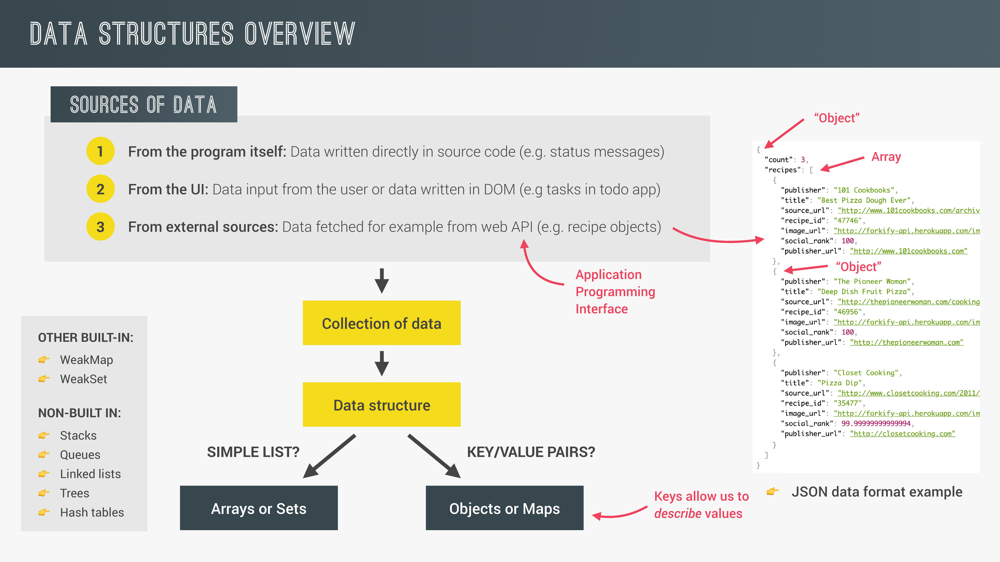

# Data Structures and Modern Operators

## 1. Destructuring (구조 분해 할당.)

구조 분해 할당 구문은 배열이나 객체의 속성을 해체하여 그 값을 개별 변수에 담을 수 있게 하는 JavaScript 표현식이다.

### 1-1. Arrays

배열의 구조 분해 할당은 기본적으로 아래와 같이 이루어진다.

```js
const arr = [2, 3, 4];
//일반적인 배열의 요소를 변수에 할당하는 방법
const a = arr[0];
const b = arr[1];
const c = arr[2];

//구조 분해 할당.
const [x, y, z] = arr;
console.log(x, y, z); // 2, 3, 4
```

다음과 같은 객체가 있다고 했을때,

```js
const restaurant = {
  name: "Classico Italiano",
  location: "Via Angelo Tavanti 23, Firenze, Italy",
  categories: ["Italian", "Pizzeria", "Vegetarian", "Organic"],
  starterMenu: ["Focaccia", "Bruschetta", "Garlic Bread", "Caprese Salad"],
  mainMenu: ["Pizza", "Pasta", "Risotto"],
  order: function (starterIndex, mainIndex) {
    return [this.starterMenu[starterIndex], this.mainMenu[mainIndex]];
  },

  openingHours: {
    thu: {
      open: 12,
      close: 22,
    },
    fri: {
      open: 11,
      close: 23,
    },
    sat: {
      open: 0, // Open 24 hours
      close: 24,
    },
  },
};
```

배열의 구조 분해 할당은 다양한 방법으로 사용 가능하다.

```js
const [first, , second] = restaurant.categories; // , , 로 인해 중간에 한 요소를 건너 뜀.
console.log(first, second); // Italian Vegetarian
```

```js
let [main, , secondary] = restaurant.categories;

//Switching variables
// const temp = main;
// main = secondary;
// secondary = temp;

//Switching variables with destructuring operator
[main, secondary] = [secondary, main];
```

```js
//Receive 2 return values from a function
const [starter, mainCourse] = restaurant.order(2, 2);
console.log(starter, mainCourse);
```

```js
// Nested destructuring
const nested = [2, 4, [5, 6]];

// const [i, , j] = nested;
// console.log(i, j); // 2 [5, 6]

const [i, , [j, k]] = nested;
console.log(i, j, k); // 2, 5, 6
```

```js
//Default values
const [p = 1, q = 1, r = 1] = [8, 9];
console.log(p, q, r); // 8 9 1
```

### 1-2. Objects

객체의 구조 분해 할당은 아래와 같이 이루어진다.

```js
const restaurant = {
  name: "Classico Italiano",
  location: "Via Angelo Tavanti 23, Firenze, Italy",
  categories: ["Italian", "Pizzeria", "Vegetarian", "Organic"],
  starterMenu: ["Focaccia", "Bruschetta", "Garlic Bread", "Caprese Salad"],
  mainMenu: ["Pizza", "Pasta", "Risotto"],
  order: function (starterIndex, mainIndex) {
    return [this.starterMenu[starterIndex], this.mainMenu[mainIndex]];
  },

  openingHours: {
    thu: {
      open: 12,
      close: 22,
    },
    fri: {
      open: 11,
      close: 23,
    },
    sat: {
      open: 0, // Open 24 hours
      close: 24,
    },
  },
};
```

위와 같은 객체가 있을때, 아래처럼 배열의 구조 분해와 다르게 객체는 index를 사용하지 않기 때문에 변수로 할당할 프로퍼티 명을 좌변의 {} 안에 작성하고 우변에 객체를 작성하면 된다.

```js
const { name, openingHours, categories } = restaurant;
console.log(name, openingHours, categories); // Classico Italiano {thu: {…}, fri: {…}, sat: {…}} (4) ["Italian", "Pizzeria", "Vegetarian", "Organic"]
```

변수명을 임의로 정하고 싶다면 좌변을 {프로퍼티명:변수명,...}과 같이 작성한다.

```js
const {
  name: restaurantName,
  openingHours: hours,
  categories: tags,
} = restaurant;

console.log(restaurantName, hours, tags); // Classico Italiano {thu: {…}, fri: {…}, sat: {…}} (4) ["Italian", "Pizzeria", "Vegetarian", "Organic"]
```

아래처럼 =을 사용하여 default값을 설정할 수 있다. {}안에 작성한 프로퍼티가 존재하지 않는다면 ( 존재한다면 default값은 적용되지 않는다. ) 해당 변수는 default값을 가지게 된다.

```js
const { menu = [], starterMenu: starters = [] } = restaurant;

console.log(menu, starters);
```

배열의 구조 분해 할당과 마찬가지로 객체를 사용하여 변수의 값을 바꿀 수 있다. 괄호를 사용해야 한다는 것에 주의해야한다.

```js
let a = 111;
let b = 999;

const obj = { a: 23, b: 7, c: 14 };

// { a, b } = obj; //error
({ a, b } = obj);
console.log(a, b); // 23 7
```

중첩된 배열을 구조 분해할 수 있는것과 마찬가지로 객체도 가능한데, : 이후 {}를 중복으로 사용하면 된다.

```js
const {
  fri: { open: o, close: c },
} = openingHours;
console.log(o, c);
```

restaurants 객체의 method를 아래와같이 변경하면 객체를 arguments로 전달함과 동시에 구조 분해가 이루어진다. 또한 parameter에 = 를 사용하여 default 값을 설정할 수 있다.

```js
orderDelivery: function ({
    starterIndex = 1,
    mainIndex = 0,
    time = '20:00',
    address,
  }) {
    console.log(starterIndex);
    console.log(
      `Order received! ${this.starterMenu[starterIndex]} and ${this.mainMenu[mainIndex]} will be delivered to ${address} at ${time}`
    );
  },
```

```js
restaurant.orderDelivery({
  time: "22:30",
  address: "Via del sole, 21",
  mainIndex: 2,
  starterIndex: 2,
}); // Order received! Garlic Bread and Risotto will be delivered to Via del sole, 21 at 22:30

restaurant.orderDelivery({
  address: "Via del sole, 21",
  starterIndex: 2,
}); // Order received! Garlic Bread and Pizza will be delivered to Via del sole, 21 at 20:00
```

## 2. The Spread Operator (...)

es6부터 제시된 연산자. iterable (array, string, map, set. object는 불가능. es2018부터는 object도 사용 가능. )에 사용가능하다. 사용하면 모든 개별 요소의 값을 얻을 수 있다. 구조 분해 할당 연산자와 다른 점은 기본적으로 모든 요소를 얻는다는 것이며 새로운 변수를 생성하지 않는다는 것이다. Spread Operator는 쉼표로 구분된 값을 쓰는 장소에서만 사용할 수 있다.( ex.배열 생성( [ ] ), 함수의 parameter에 값 전달. )

아래는 배열에서의 예시이다.

```js
const arr = [7, 8, 9];
const badNewArr = [1, 2, arr[0], arr[1], arr[2]];
console.log(badNewArr); // [1, 2, 7, 8, 9]

const newArr = [1, 2, ...arr];
arr.push(4);
console.log(newArr); // [1, 2, 7, 8, 9]
console.log(arr); // [7, 8, 9, 4]
```

함수에서의 예시는 다음과 같다. 이를 통해 우리는 spread 연산자를 통해 콤마로 구분된 값을 얻는다는 것을 알 수 있다.

```js
console.log(...newArr); // 1 2 7 8 9
console.log(1, 2, 7, 8, 9); // 1 2 7 8 9
```

spread 연산자로 아래와 같이 얕은 복사를 수행하거나 두 객체를 병합할 수 있다.

```js
//Copy array
const mainMenuCopy = [...restaurant.mainMenu];
console.log(restaurant.mainMenu); // ["Pizza", "Pasta", "Risotto"]

//join 2 arrays
const menu = [...restaurant.starterMenu, ...restaurant.mainMenu];
console.log(menu); // ["Focaccia", "Bruschetta", "Garlic Bread", "Caprese Salad", "Pizza", "Pasta", "Risotto"]
```

위에서 설명했다시피 spread 연산자는 배열 외에도 iterable( array, string, map, set )에 사용가능하다. (es2018 이후에는 object도 사용가능.)

문자열에서의 사용예.

```js
//Iterables : arrays, strings, maps, sets. Not objects
const str = "Jonas";
const letters = [...str, " ", "S."];
console.log(letters); // ["J", "o", "n", "a", "s", " ", "S."]
```

또한 콤마로 구분된 값을 사용하는 곳에만 적용이 된다

```js
console.log(...str); // J o n a s
// console.log(`${...str}`); // error!
```

함수의 parameter를 통한 값 전달에 사용되는 예를 보기위해 restaurant 객체에 아래와 같은 method를 추가했다.

```js
orderPasta: function (ing1, ing2, ing3) {
    console.log(`Here is your delicious pasta with ${ing1}, ${ing2}, ${ing3}`);
  },
```

orderPasta method에 spread 연산자를 이용하여 값을 전달하면 아래와 같다.

```js
const ingredients = ["mushrooms", "aspargus", "cheese"];

// restaurant.orderPasta(ingredients[0], ingredients[1], ingredients[2]);
restaurant.orderPasta(...ingredients); // Here is your delicious pasta with mushrooms, aspargus, cheese
```

es2018이후부터는 object에도 spread 연산자 사용이 가능해졌다. object에서의 사용 예.

```js
const restaurantCopy = { ...restaurant }; // Shallow copy
restaurantCopy.name = "Ristorante Roma";
console.log(restaurant.name); // Classico Italiano
console.log(restaurantCopy.name); // Ristorante Roma

const newRestaurant = { ...restaurant, founder: "Guiseppe", foundedIn: 1998 };

console.log(newRestaurant); // founder, foundedIn 프로퍼티가 추가되어 출력.
```

## 3. Rest Pattern and Parameters

Resr pattern은 spread 연산자와 문법이 같지만(...) 정 반대의 기능을 가졌다. Rest pattern은 spread 연산자와는 반대로 요소들을 모아서 객체를 생성한다. 기본적으로 우항에서 사용하는 spread 연산자와는 달리 Rest Pattern은 좌항에서 사용한다.

아래는 배열에서의 사용예이다. 구조 분해 할당 시 가장 끝에 위치하여 우항에서 할당되지 않고 남은 모든 요소들로 배열을 생성한다.

```js
const [a, b, ...others] = [1, 2, 3, 4, 5];

console.log(a, b, others); // 1 2 [3, 4, 5]
```

아래에서 나타난것과 같이 우항에서 사용하면 spread, 좌항에서 사용하면 rest pattern이며 rest pattern을 통해 만들어지는 배열은 구조 분해 할당 시 건너뛴 요소는 포함하지 않는다.

```js
const [pizza, , risotto, ...otherFood] = [
  ...restaurant.mainMenu,
  ...restaurant.starterMenu,
];

console.log(otherFood); // ["Focaccia", "Bruschetta", "Garlic Bread", "Caprese Salad"]
```

rest pattern은 객체에도 사용이 가능하다. 아래에 예시가 있다.

```js
const { sat, ...weekdays } = restaurant.openingHours;

console.log(weekdays); // {thu: {…}, fri: {…}}
```

또한 함수 정의시 parameter로도 사용이 가능하다. 사용법은 기본적으로 위와 같으며 예시를 보면 함수 호출 시 파라미터에 할당되지 않은 arguments로 배열을 생성하는 것을 알 수 있다.

```js
const add = function (a, b, ...numbers) {
  console.log(a, b, numbers);
};

add(2, 3); // 2 3 []
add(5, 3, 7, 2); // 5 3 [7, 2]
add(8, 2, 5, 3, 2, 1, 4); // 8 2 [5, 3, 2, 1, 4]
```

```js
const add = function (...numbers) {
  let sum = 0;
  for (let i = 0; i < numbers.length; i++) {
    sum += numbers[i];
  }
  console.log(sum);
};
const x = [23, 5, 7];

add(...x); // 35
```

## 4. Short Circuiting (&& and ||)

&&와 ||에는 모든 값을 사용할 수 있으며 또한 이들은 모든 값을 반환할 수 있다.

### 4-1. OR ( || )

|| 사용시 첫번째 피연산자가 truthy value라면 곧바로 그 값을 반환한다. 이 때, 다른 피연산자는 비교를 하지도 않는다. 이러한 현상을 Short Circuiting이라고 한다. 만약 두 피연산자가 모두 falsy value라면 마지막 피연산자를 반환한다.

예시

```js
console.log(3 || "Jonas"); // 3
console.log("" || "Jonas"); // Jonas
console.log(true || 0); // true
console.log(undefined || null); // null
console.log(undefined || 0 || "" || "Hello" || 23 || null); // Hello
```

이러한 성질은 default value를 설정하는데에 활용할 수 있다. 아래 예시에서 restaurant.numGuests는 존재하지 않는다.(undefined) 따라서 guests에는 10이 할당되는데 만약 존재한다면 Short Circuiting에 의해 10이아닌 restaurant.numGuests가 할당 될 것이다.

```js
const guests = restaurant.numGuests || 10;
console.log(guests); // 10
```

### 4-2. AND ( && )

AND는 OR과는 반대의 Short Circuiting을 수행한다. 첫번째 피연산자가 falsy value이면 다른 피연산자는 비교를 수행하지 않고 바로 해당 falsy value를 반환한다.
만약 모든 피연산자가 truthy value라면 마지막 피연산자를 반환한다.

예시

```js
console.log(0 && "Jonas"); // 0
console.log(7 && "Jonas"); // Jonas
console.log("Hello" && 23 && "null" && "Jonas"); // Jonas
```

아래 예시는 AND를 활용해서 restaurant.orderPizza Method가 존재하지 않는다면 곧바로 undefined를 반환하고 존재한다면 이를 호출하는 코드이다.

```js
restaurant.orderPizza && restaurant.orderPizza("mushrooms", "spinach");
```

## 5. The Nullish Coalescing Operator (??)

Nullish value란 null과 undefined를 의미한다.(0과 ''은 아님.) ??은 Nullish Coalescing Operator라고 하며 es2020에서 제시되었으며 ||과 같은 기능을 하지만 0과 ''을 truthy value 취급한다.

예시.

```js
restaurant.numGuests = 0;
// Nullish : null and undefined (Not 0 or ``)
const guestCorrect = restaurant.numGuests ?? 10; // 0
console.log(guestCorrect);
```

## 6. Looping Arrays: The for-of Loop

배열의 모든 요소에 대해 반복적인 작업을 해야할 때 활용하기 좋다. 문법은 아래 코드를 확인하자. for문 안에서 menu배열의 모든 요소가 순서대로 item 변수에 할당이 되고 우리는 이를 사용할 수 있게 된다.

```js
const menu = [...restaurant.starterMenu, ...restaurant.mainMenu];

for (const item of menu) {
  console.log(item); // menu 배열의 모든 요소 출력.
}
```

배열의 entries 메소드를 활용하여 모든 요소로부터 인덱스와 요소의 값으로 이루어진 배열을 얻을 수 있다.

```js
for (const item of menu.entries()) {
  console.log(item);
}
//(2) [0, "Focaccia"]
// [1, "Bruschetta"]
// [2, "Garlic Bread"] ....
```

이를 아래와 같이 구조 분해 할당과 함께 사용할 수도 있다.

```js
for (const [i, el] of menu.entries()) {
  console.log(`${i + 1} : ${el}`);
}
//1 : Focaccia
//2 : Bruschetta
//3 : Garlic Bread...
```

## 7. Enhanced Object Literals

우선 아래와 같이 객체가 선언이 되어 있다고 한다.

```js
const restaurant = {
  name: "Classico Italiano",
  location: "Via Angelo Tavanti 23, Firenze, Italy",
  categories: ["Italian", "Pizzeria", "Vegetarian", "Organic"],
  starterMenu: ["Focaccia", "Bruschetta", "Garlic Bread", "Caprese Salad"],
  mainMenu: ["Pizza", "Pasta", "Risotto"],
  order: function (starterIndex, mainIndex) {
    return [this.starterMenu[starterIndex], this.mainMenu[mainIndex]];
  },

  openingHours: {
    thu: {
      open: 12,
      close: 22,
    },
    fri: {
      open: 11,
      close: 23,
    },
    sat: {
      open: 0, // Open 24 hours
      close: 24,
    },
  },
  orderDelivery: function ({
    starterIndex = 1,
    mainIndex = 0,
    time = "20:00",
    address,
  }) {
    console.log(starterIndex);
    console.log(
      `Order received! ${this.starterMenu[starterIndex]} and ${this.mainMenu[mainIndex]} will be delivered to ${address} at ${time}`
    );
  },
  orderPasta: function (ing1, ing2, ing3) {
    console.log(`Here is your delicious pasta with ${ing1}, ${ing2}, ${ing3}`);
  },
  orderPizza: function (mainIngredient, ...otherIngredients) {
    console.log(mainIngredient);
    console.log(otherIngredients);
  },
};
```

여기서 객체안의 객체 즉, openingHours 프로퍼티를 분리하고 별개의 변수에 할당하고 포함되길 원하는 객체의 내부에 변수명을 작성하면 해당 변수(객체)를 프로퍼티로 갖게된다.

예시

```js
const openingHours = {
  thu: {
    open: 12,
    close: 22,
  },
  fri: {
    open: 11,
    close: 23,
  },
  sat: {
    open: 0, // Open 24 hours
    close: 24,
  },
};

const restaurant = {
  name: "Classico Italiano",
  location: "Via Angelo Tavanti 23, Firenze, Italy",
  categories: ["Italian", "Pizzeria", "Vegetarian", "Organic"],
  starterMenu: ["Focaccia", "Bruschetta", "Garlic Bread", "Caprese Salad"],
  mainMenu: ["Pizza", "Pasta", "Risotto"],
  order: function (starterIndex, mainIndex) {
    return [this.starterMenu[starterIndex], this.mainMenu[mainIndex]];
  },
  orderDelivery: function ({
    starterIndex = 1,
    mainIndex = 0,
    time = "20:00",
    address,
  }) {
    console.log(starterIndex);
    console.log(
      `Order received! ${this.starterMenu[starterIndex]} and ${this.mainMenu[mainIndex]} will be delivered to ${address} at ${time}`
    );
  },
  orderPasta: function (ing1, ing2, ing3) {
    console.log(`Here is your delicious pasta with ${ing1}, ${ing2}, ${ing3}`);
  },
  orderPizza: function (mainIngredient, ...otherIngredients) {
    console.log(mainIngredient);
    console.log(otherIngredients);
  },

  //openingHours: openingHours, // es6이전에 사용하던 방법.
  openingHours, // es6 enhanced object literals
};
```

메소드 프로퍼티를 선언할 때 기존처럼 프로퍼티명:함수표현식의 형태가 아닌 함수정의의 형태로 메소드 프로퍼티를 선언할 수 있다.

```js
///////////////////////////////////////////////////객체 내부라고 가정.
  // order: function (starterIndex, mainIndex) {
  //   return [this.starterMenu[starterIndex], this.mainMenu[mainIndex]];
  // },
  order(starterIndex, mainIndex) {
    return [this.starterMenu[starterIndex], this.mainMenu[mainIndex]];
  }
```

[]를 사용하여 프로퍼티명을 수동으로 작성하는 것이 아닌 계산을 통해 지어낼 수 있다.

```js
const weekdays = ["mon", "tue", "wed", "thu", "fri", "sat", "sun"];

const openingHours = {
  [weekdays[3]]: {
    open: 12,
    close: 22,
  },
  [weekdays[4]]: {
    open: 11,
    close: 23,
  },
  [`day-${2 + 4}`]: {
    open: 0,
    close: 24,
  },
};
```

## 8. Optional Chaining (?.)

Optional Chaining 연산자(?.)는 프로퍼티에 접근할 때 사용된 객체가 nullish value라면 곧바로 undefined를 반환하게하는 연산자이다. Nullish Coalescing Operator(??)와 함께 활용하기 좋다.

예시

```js
console.log(restaurant.openingHours.mon?.open); // restaurant.openingHours.mon 프로퍼티가 nullish value라면 undefined 반환, 그렇지 않다면 open 프로퍼티 반환.
console.log(restaurant.openingHours?.mon?.open); // 중첩된 객체의 프로퍼티에 접근할 때 연속해서 사용 가능하다.

const days = ["mon", "tue", "wed", "thu", "fri", "sat", "sun"];

for (const day of days) {
  const open = restaurant.openingHours[day]?.open ?? "closed"; // restaurant.openingHours[day]가 Nullish value라면 undefined를 반환하고 ??에 의해서 default value로 closed가 변수에 할당 됨.
  console.log(`On ${day}, we open at ${open}`);
}
```

Method에 적용된 예시

```js
console.log(restaurant.order?.(0, 1) ?? "Method does not exist"); //["Focaccia", "Pasta"].
console.log(restaurant.orderRisotto?.(0, 1) ?? "Method does not exist"); // Method does not exist.
```

배열에 적용된 예시

```js
const users = [{ name: "Jonas", email: "hello@jonas.io" }];

console.log(users[0]?.name ?? "User array empty"); // Jonas
console.log(users[1]?.name ?? "User array empty"); // User array empty
```

## 9. Looping Objects: Object Keys, Values, and Entries

객체에는 객체의 키, 값, 엔트리를 요소로 갖는 배열을 생성하는 메소드가 존재한다.

### 9-1. Object.keys(object)

객체의 키를 요소로하는 배열 생성.

```js
const properties = Object.keys(openingHours);

console.log(properties); // ["thu", "fri", "sat"]

let openStr = `We are Open on ${properties.length} days: `;

for (const day of properties) {
  openStr += `${day}, `;
}

console.log(openStr); // We are Open on 3 days: thu, fri, sat,
```

### 9-2. Object.Values(object)

객체의 값을 요소로 하는 배열 생성.

```js
const values = Object.values(openingHours);

console.log(values); // [{open: 12, close: 22},{open: 11, close: 23},{open: 0, close: 24}]
```

### 9-3. Object.Entries(object)

객체의 키,값으로 이루어진 배열을 요소로 하는 배열 생성.

```js
const entries = Object.entries(openingHours);

console.log(entries); // [["thu", {open: 12, close: 22}], ["fri", {open: 11, close: 23}], ["sat", {open: 0, close: 24}]]

for (const [day, { open, close }] of entries) {
  console.log(`On ${day} we open in ${open} and close in ${close}`);
}
// On thu we open in 12 and close in 22
// On fri we open in 11 and close in 23
// On sat we open in 0 and close in 24
```

## 10. Sets

es6에서 도입된 두 자료구조(set,map)중 하나. set은 기본적으로 고유한 값의 집합이다. 한마디로 값의 중복이 발생하지 않는다. 이는 특정 상황에서 아주 유용하다. Set의 생성은 new Set();을 통해 이루어지며 괄호안에 iterable이 전달될 수 있다.(배열,문자열 등) set의 가장 큰 특징은 값의 중복이 발생하지 않는다는 것과 배열과는 달리 값에 순서가 없다는 것이다.

예시

```js
const ordersSet = new Set(["Pasta", "Pizza", "Risotto", "Pasta", "Pizza"]);

console.log(ordersSet); // {"Pasta", "Pizza", "Risotto"}
console.log(ordersSet.size); // 3
```

set의 대표적인 프로퍼티, 메소드는 아래와 같다.

```js
console.log(ordersSet.size); // 3
console.log(ordersSet.has("Pizza")); // true
console.log(ordersSet.has("Bread")); // false

ordersSet.add("Garlic Bread");
ordersSet.add("Garlic Bread");
ordersSet.delete("Risotto");

console.log(ordersSet); // {"Pasta", "Pizza", "Garlic Bread"}
```

또한 set은 iterable이므로 looping이 가능하다.

```js
for (const order of ordersSet) {
  console.log(order);
}
// Pasta
// Pizza
// Garlic Bread
```

set은 iterable의 중복을 제거하거나 값의 종류가 몇가지인지 알아내는 데에 활용할 수 있다.

```js
const staff = ["Waiter", "Chef", "Waiter", "Manager", "Chef", "Waiter"];
const staffUnique = [...new Set(staff)]; // set 생성 후 spread 연산자를 통해 배열로 복사.

console.log(staffUnique); // ["Waiter", "Chef", "Manager"]
console.log(new Set(staff).size); // 3
```

## 11. Maps: Fundamentals

key와 value로 이루어진 자료구조이다. 객체와 유사하다고 생각할 수 있지만 map에서는 key가 모든 타입을 지닐 수 있다는 것에서 큰 차이가 있다. map은 set과 마찬가지로 new 키워드를 사용하여 생성하며 set 메소드를 통해 요소를 삽입할 수 있다.

```js
const rest = new Map();
rest.set("name", "Classico Italiano");
rest.set(1, "Firenze, Italy");
// map의 set 메소드는 갱신된 map을 반환한다.
console.log(rest.set(2, "Lisbon, Portugal")); // {"name" => "Classico Italiano", 1 => "Firenze, Italy", 2 => "Lisbon, Portugal"}
```

map은 get 메소드를 통해 값을 가져올 수 있다.

```js
rest
  .set("categories", ["Italian", "Pizzeria", "Vegetarian", "Organic"])
  .set("open", 11)
  .set("close", 23)
  .set(true, "We are open :D")
  .set(false, "We are closed :(");

console.log(rest); // {"name" => "Classico Italiano", 1 => "Firenze, Italy", 2 => "Lisbon, Portugal", "categories" => Array(4), "open" => 11, …}

console.log(rest.get("name")); // Classico Italiano
console.log(rest.get(true)); // We are open :D

const time = 21;
console.log(rest.get(time > rest.get("open") && time < rest.get("close"))); // We are open :D
```

이 외에도 다른 메소드와 프로퍼티가 존재한다. 예시는 아래와 같다.

```js
console.log(rest.has("categories")); // true
rest.delete(2);
console.log(rest); // {"name" => "Classico Italiano", 1 => "Firenze, Italy", "categories" => Array(4), "open" => 11, "close" => 23, …}
console.log(rest.size); // 7
rest.clear();
console.log(rest.size); // 0
```

key가 객체라면, 아래와 같은 문제가 발생할 수 있다.

```js
rest.set([1, 2], "Test");
console.log(rest); // {Array(2) => "Test"}
console.log(rest.get([1, 2])); // undefined
```

이는 set에서의 [1,2]와 get에서의 [1,2]는 힙메모리의 각자 다른 위치에 생성이 되기 때문에 동일하지 않다고 인식되기 때문이다. 그래서 아래와 같은 방법으로 해결할 수 있다.

```js
const arr = [1, 2];
rest.set(arr, "Test");
console.log(rest);
console.log(rest.get(arr)); // Test
```

## 12. Maps: Iteration

map을 생성할 때 아래와 같이 배열을 사용하여 여러 요소를 삽입할 수 있다.

```js
const question = new Map([
  ["question", "What is the best programming language in the world?"],
  [1, "C"],
  [2, "Java"],
  [3, "JavaScript"],
  ["correct", 3],
  [true, "Correct 🎉"],
  [false, "Try again!"],
]);
const answer = 3;
console.log(question); // {"question" => "What is the best programming language in the world?", 1 => "C", 2 => "Java", 3 => "JavaScript", "correct" => 3, …}
console.log(question.get(answer === question.get("correct"))); // Correct 🎉
```

여기서 우리는 Object.entries 메소드를 활용하여 손쉽게 객체를 map으로 변환할 수 있다는 것을 알 수 있다.

```js
console.log(Object.entries(openingHours)); // ["thu", {…}],["fri", {…}],["sat", {…}]
const hoursMap = new Map(Object.entries(openingHours));
console.log(hoursMap); // {"thu" => {…}, "fri" => {…}, "sat" => {…}}
```

map은 iterable이기 때문에 iteration이 가능하다.

```js
for (const [key, value] of question) {
  if (typeof key === "number") {
    console.log(`${key} is ${value}`);
  }
}
// 1 is C
// 2 is Java
// 3 is JavaScript
```

set과 마찬가지로 spread 연산자를 사용해서 배열로 변환이 가능하다. 또는 keys 와 values 메소드, spread 연산자를 함께 사용해서 key, value를 따로 배열로 생성할 수도 있다.

```js
const arr = [...question];
console.log(arr); // [Array(2), Array(2), Array(2), Array(2), Array(2), Array(2), Array(2)]
console.log([...question.keys()]); // ["question", 1, 2, 3, "correct", true, false]
console.log([...question.values()]); // ["What is the best programming language in the world?", "C", "Java", "JavaScript", 3, "Correct 🎉", "Try again!"]
```

## 12. Summary: Which Data Structure to Use?



### 12-1. Sources of data

1.  프로그램 자체 : 소스 코드로 직접 작성된 데이터(예: 상태 메시지)

2.  UI : 사용자가 입력한 데이터 또는 DOM으로 작성된 데이터(예: todo 앱에서의 작업.)

3.  외부 : web API에서 가져온 데이터(예: recipe object)

우리는 위의 경로로 데이터들을 수집하고 자료구조에 저장하게 된다.

### 12-2. 어떤 자료구조를 사용할까?

데이터를 단순하게 나열하려면 array 또는 set, key를 활용해 데이터를 묘사하려면 object 또는 map을 사용하자.

### 12-3. web APIs

일반적인 데이터의 원천, JSON 형태로 데이터를 제공한다. JSON은 자바스크립트의 객체, 배열과 같은 형태로 표현되기 때문에 활용이 용이하다.

### 12-4. Arrays vs Sets and Object vs Maps


- Arrays vs Sets

  - 순서가 매겨진 데이터가 필요하거나 데이터를 조작해야 한다면 Array 사용.

  - 유일한 값을 다루는 작업을 해야하거나 높은 성능이 중요할 때, 배열에서 중복된 데이터를 제거해야할 때는 set 사용.

- Objects와 Maps. 각자의 장점.

  - Object

    1. map보다 더 전통적인 key/value 자료구조. ( 하지만 단순히 key/value를 저장하기 위한 사용은 여러 기술적인 단점이 존재. 몇몇 사람들이 object를 남용해왔다고 하는 이유. )

    2. [] 과 .을 활용하여 쉽게 값에 접근하고 사용할 수 있다.

  - Map

    1. 더 좋은 성능.

    2. key가 모든 타입을 가질 수 있다.

    3. iterate 하기 쉽다.

    4. 크기를 계산하기 쉽다.

- Objects vs Maps

  - method를 필요로 하거나 JSON을 사용하는 작업을 할때는 Object 사용.

  - 단순한 key/value 데이터구조를 사용해야하거나 String이 아닌 key 값을 사용해야 할때는 Map 사용.

## 13. Working With Strings

### 13-1. 문자열의 기본적인 활용

우선 아래와 같은 문자열이 있다.

```js
const airline = "TAP Air Portugal";
const plane = "A320";
```

- [ ], length

  배열과 같이 index를 사용해 문자 하나에 접근할 수 있으며 length 프로퍼티로 문자열의 길이를 알 수 있다.

  ```js
  // []
  console.log(plane[0]); // A
  console.log(plane[1]); // 3
  console.log(plane[2]); // 2
  console.log("B737"[0]); // B

  // length
  console.log(airline.length); // 16
  console.log("B737".length); // 4
  ```

- indexOf, lastIndexOf

  indexOf, lastIndexOf 메소드를 활용해 원하는 문자,문자열의 index를 얻을 수 있다.

  ```js
  // indexOf, lastIndexOf
  console.log(airline.indexOf("r")); // 6
  console.log(airline.lastIndexOf("r")); // 10
  console.log(airline.indexOf("Portugal")); // 8
  console.log(airline.indexOf("portugal")); // -1
  ```

- slice

  slice 메소드로 문자열을 잘라낼 수 있다. slice(첫글자 index, 마지막글자 index + 1)과 같이 잘라내길 원하는 문자,문자열의 첫글자 인덱스와 마지막 글자의 인덱스를 활용한다. 문자열의 인덱스는 -를 붙여 마지막 글자부터 시작할수도 있다. (인덱스 -1은 마지막 인덱스)

  ```js
  // slice
  console.log(airline.slice(4)); // Air Portugal
  console.log(airline.slice(4, 7)); // Air
  console.log(airline.slice(0, airline.indexOf(" "))); // TAP
  console.log(airline.slice(airline.lastIndexOf(" ") + 1)); // Portugal
  console.log(airline.slice(-2)); // al
  console.log(airline.slice(1, -1)); // AP Air Portuga
  ```

- String은 primitive type이라고 배웠는데 왜 메소드와 프로퍼티가 존재할까?

  String은 객체가 아니다. 하지만 우리가 스트링의 메소드 프로퍼티를 호출하면 자바스크립트는 자동적으로 String primitive를 String object로 변환한다고 한다. 이러한 과정을 boxing이라고 한다. 마치 우리의 String을 object box안에 집어 넣는것과 같은 느낌으로 이해할 수 있다. 위의 몇몇 method 또는 property는 string primitive을 반환하는데 이는 마치 객체로 변환된 문자열을 다시 원래의 문자열로 재변환하는 것처럼 보인다.

  String object는 아래와 같이 직접 생성할수도 있는데 콘솔에 출력된 내용을 보면 위의 method, property들이 존재하는 것을 알 수 있다.

  ```js
  const jonas = new String("Jonas");

  console.log(jonas);
  // String {"Jonas"}
  //0: "J"
  // 1: "o"
  // 2: "n"
  // 3: "a"
  // 4: "s"
  // length: 5
  // __proto__: String
  // [[PrimitiveValue]]: "Jonas"

  console.log(typeof jonas); // object
  console.log(typeof new String("Jonas").slice(1)); //string
  ```

### 13-2. 문자열 변환

- toLowerCase,toUpperCase

  문자열의 모든 문자를 소문자 또는 대문자로 변환한다.

  ```js
  console.log(airline.toLowerCase()); // tap air portugal
  console.log(airline.toUpperCase()); // TAP AIR PORTUGAL

  //Fix capitalization in name
  const passenger = "jOnAS";
  const passengerLower = passenger.toLowerCase();
  const passengerCorrect =
    passengerLower[0].toUpperCase() + passengerLower.slice(1);

  console.log(passengerCorrect); // Jonas
  ```

- trim

  문자열에 존재하는 공백을 제거한다.

  ```js
  const email = "hello@jonas.io";
  const loginEmail = "   Hello@Jonas.Io \n";

  // const lowerEmail = loginEmail.toLowerCase();
  // const trimmedEmail = lowerEmail.trim();
  // console.log(trimmedEmail); // hello@jonas.io

  const normalizedEmail = loginEmail.toLowerCase().trim();

  console.log(normalizedEmail); // hello@jonas.io
  console.log(email === normalizedEmail); // true
  ```

- replace, replaceAll

  문자열에 존재하는 특정 문자,문자열을 원하는 문자, 문자열로 변경한다. replace는 처음 나타나는 해당 문자열만, replaceAll은 모든 해당하는 문자열을 변경한다.

  ```js
  const priceGB = "288,97£";
  const priceUS = priceGB.replace("£", "$").replace(",", ".");
  console.log(priceUS); // 288.97

  const announcement =
    "All passengers come to barding door 23. Boarding door 23!";

  console.log(announcement.replace("door", "gate")); // All passengers come to barding gate 23. Boarding door 23!
  console.log(announcement.replaceAll("door", "gate")); // All passengers come to barding gate 23. Boarding gate 23!
  console.log(announcement.replace(/door/g, "gate")); // All passengers come to barding gate 23. Boarding gate 23!
  ```

- Boolean을 반환하는 여러 메소드들

  includes는 임의의 문자,문자열의 포함여부, startWiths,endWiths는 각각 문자열이 임의의 문자 또는 문자열로 시작하는지, 끝나는지의 여부를 반환.

  ```js
  console.log(plane.includes("A")); // true
  console.log(plane.includes("B")); // false
  console.log(plane.startsWith("A3")); // true
  console.log(plane.startsWith("3")); // flase
  console.log(plane.endsWith("20")); // true
  console.log(plane.endsWith("10")); // false
  ```

활용 예제

```js
const checkBaggage = function (items) {
  const baggage = items.toLowerCase();
  1;
  if (baggage.includes("knife") || baggage.includes("gun")) {
    console.log("you are not allowed on board");
  } else {
    console.log("Welcome aboard!");
  }
};
checkBaggage("I have a laptop, some Food and a pocket knife"); // 'you are not allowed on board
checkBaggage("Socks and camera"); // Welcome aboard!
checkBaggage("Got some snacks and a gun for protection"); // 'you are not allowed on board
```
