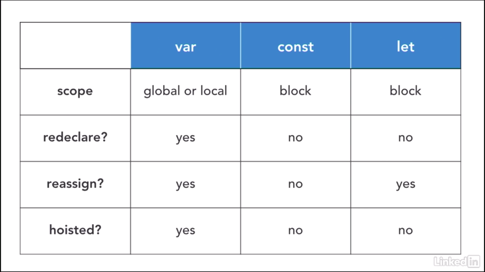

# How JavaScript Works Behind the Scenes

## 1. An High-Level Overview of JavaScript

자바스크립트는 고수준, 객체기반의 다중 패러다임 언어이다.

### 1-1. High-level

자바스크립트는 메모리를 직접 관리하는 저수준 언어와 달리 자동으로 메모리를 관리하는 고수준 언어이다.

### 1-2. Garbage-collection

자바스크립트에서 자동으로 메모리관리를 수행해주는 주체이다. 기본적으로 오래되고 사용하지 않는 객체를 자동으로 제거하는 자바스크립트 엔진 내부의 알고리즘이다.

### 1-3. Interpreted or just-in-time compiled

자바스크립트는 컴파일링이 자바스크립트 엔진을 통해 이루어지는데 이때 인터프리터와 just-in-time compiler(JITC)를 사용한다.

### 1-4. Multi-paradigm

프로그래밍에서 패러다임이란 프로그래밍에 대한 관점 및 방법론을 의미한다. 다시말해서, 이는 코드 구조에 대한 접근법과 사고방식이며 프로그래머의 코딩 스타일과 기술을 지시한다. 프로그래밍 언어에는 절차적, 객체지향, 함수형 등의 패러다임이 존재한다. 많은 언어들이 한가지 패러다임을 갖는데에 반해 자바스크립트는 여러 패러다임을 갖는다. 그래서 매우 유연하고 다재다능하다. 자바스크립트의 객체 지향적인 특성에 대해 설명하자면, 자바스크립트는 프로토타입을 기반으로 하는 객체지향적 특성을 갖는다. 원시타입을 제외한 자바스크립트의 거의 모든것은 객체이다. 우리가 Array와 같은 객체를 생성하고 method를 사용할 수 있는것은 프로토타입 상속 덕분이다.

### 1-5. First-class functions

자바스크립트에서는 함수를 다른 일반적인 변수들처럼 다룰 수 있는데 이와같은 함수를 First-class functions라고 한다. First-class functions은 함수를 변수나 데이터구조 안에 담거나 다른 함수의 파라미터로 전달할 수 있고 반환값으로도 사용하는 등 여러 기능이 있다. First-class functions는 우리가 여러 기술을 사용할 수 있게할 뿐만 아니라 함수형 패러다임을 적용할 수 있도록 한다.

### 1-6. Dynamic

자바스크립트는 동적 타입 언어이다. 변수의 타입을 지정하지 않으며 변수에 값이 할당되는 과정에서 자바스크립트 엔진이 할당되는 값의 타입을 따라서 자동으로 변수의 타입을 결정한다. 이를 통해 우리는 한 변수에 여러타입의 값을 유연하게 할당할 수 있다.

### 1-7. Single-threaded

자바스크립트는 단일 스레드에서 실행되며 이로인해 일반적으로 실행시 한번에 한가지 작업만을 수행할 수 있다.

### 1-8. Non-blocking event loop

단일 스레드로 실행되는 자바스크립트에서 긴시간이 걸리는 작업을 수행할 때 다른 작업이 blocking 되는것을 방지하기 위해서 event-loop를 사용한다. 간단히 말하자면 자바스크립트는 Web APIs를 활용한 event loop를 통해서 시간이 오래 걸리는 작업을 background에서 실행되도록 하고 메인 스레드의 작업이 모두 끝나면 이를 다시 불러온다. 이를 event loop에 기반한 동시성 모델이라고 한다. 동시성 모델이란 단일 스레드 기반의 자바스크립트가 여러 작업을 마치 동시에 수행하는 것처럼 보이게 하는것이다.(실제로 동시에 수행되는 것이 아님.)

## 2. The JavaScript Engine and Runtime

자바스트립트 엔진은 간단하게 말해서 자바스크립트 코드를 컴파일하고 실행하는 프로그램이다. 모든 브라우저는 그들만의 자바스크립트 엔진을 지니고 있다. 그 중에서 가장 유명한 자바스크립트 엔진은 Google의 V8 엔진이다. V8엔진은 구글 크롬과 node.js에서 사용된다.

### 2-1. 자바스크립트 엔진의 구조


모든 자바스크립트 엔진은 콜스택과 힙을 포함하고 있다. 콜스택은 우리의 코드가 execution context를 통해 실제로 실행되는 곳이며 힙은 애플리케이션에 필요한 모든 객체를 저장하는 구조화되지 않은 메모리 영역이다.

### 2-2. 컴파일러와 인터프리터


(컴파일러)


(인터프리터)


(Just-in-time compilation)

컴파일러와 인터프리터는 프로그래밍 언어를 0과 1로 이루어진 기계어로 변환한다는 공통점을 지니고 있으나 그 과정에 있어서 차이점이 있다. 컴파일러는 전체 소스코드를 한번에 기계어로 변환하는 반면에 인터프리터는 한 행씩 변환하고 변환과 동시에 즉시 실행해나간다. 컴파일러는 실행 가능한 프로그램이 생성되는 반면 인터프리터는 번환과 동시에 실행되므로 별 다른 프로그램이 생성되지 않는다. 자바스크립트는 순전히 인터프리터 언어였다. 인터프리터 언어는 컴파일 언어보다 느리다는 단점이 있어서 현재 다수의 자바스크립트 엔진은 이 단점을 해결하기 위해 컴파일 방식과 인터프리터 방식을 혼용하고 있는데 이를 Just-in-time compilation이라고 한다. Just-in-time compilation은 컴파일러와 마찬가지로 전체 소스코드를 한번에 기계어로 변환하는데 이때 실행프로그램은 생성하지 않고 인터프리터처럼 변환 즉시 실행한다는 특징이 있다.

### 2-3. just-in-time compiler


자바스크립트 엔진이 자바스크립트 코드를 실행하는 일반적인 과정은 아래와 같다.

1. 소스코드 파싱 => AST(Abstract Syntax Tree) 생성. ( AST : 각 코드 행을 언어에대해 의미있는 조각들로 나눈 뒤 트리 구조로 저장한것이다. )

2. 생성된 AST를 머신코드로 변환.

3. 코드 실행. 실행은 콜스택에서 이루어진다.

위의 과정은 가능한 한 빨리 실행하기 위한 과정이다. 자바스크립트 엔진은 위과정에 추가로 JIT Compiler를 활용한 최적화를 수행한다. 최적화는 프로그램 실행중에 백그라운드에서 이루어지는데 최적화된 코드는 상황에 따라 다시 deoptimize 되기도 한다. 파싱, 컴파일, 최적화의 모든 과정은 우리가 접근할 수 없는 엔진 내의 특별한 스레드에서 수행된다. 즉, 실행을 위한 메인스레드와 완벽하게 분리된 스레드에서 수행되는 것이다.

### 2-4. Runtime in the browser

자바스크립트 런타임은 우리에게 필요한 자바스크립트와 연관된 모든 것들을 담고있는 상자라고 생각하면 된다. 즉, 자바스크립트로 작성된 코드가 구동되는 환경을 의미한다.(ex. Javascript engine, Web APIs, Callback queue)

Callback queue : 모든 실행 준비된 콜백함수( ex. event handler function )를 포함하는 자료구조. 콜스택이 비어있을 때 콜백큐에 있는 콜백함수가 콜스택으로 전달되고 그 결과 실행이 된다. 이런 과정을 event loop라고 한다.

## 3. Execution Contexts and The Call Stack

Execution Contexts는 코드가 실행되고 있는 구역, 범위에 대한 추상적인 개념이다. Execution Contexts는 일부 코드가 실행되는 데 필요한 모든 정보를 저장한다. 코드를 실행하는 과정은 아래와 같다.

1. global execution context 생성. (global execution context : 특정 함수안에서 실행되는 코드가 아닌 코드들(top-level code)이 실행되는 구역)

2. global execution context 안에서 top-level code 실행.

3. 함수를 실행하고 콜백함수를 기다린다. ( 함수가 실행될때마다 각각의 함수에 대한 execute context가 만들어진다. )

### 3-1. What's inside execution context?

아래와 같은 요소들이 컨텍스트의 creation phase에 생성된다.

1. Variable Enviroment :

   아래와 같은 정보들이 저장된다.

   - 변수 선언.
   - 함수 선언.
   - arguments object. :

     실행 컨텍스트 내에서 함수 호출 시 전달된 arguments에 대한 정보를 배열의 형태로 저장하는 것.

2. Scope chain :

   현재 함수의 외부에 위치한 변수에 대한 참조로 이루어져있다.

3. this keyword :

   화살표 함수가 실행되는 실행 컨텍스트는 arguments object와 this keyword를 갖지 않는다. 하지만 이들은 가장 가까운 일반 함수 부모의 arguments object와 this keyword를 사용할 수도 있다.

### 3-2. Call stack

콜스택은 기본적으로 프로그램 실행의 위치를 추적하기위해 실행 컨텍스트가 쌓이는 장소이다. 가장 마지막에 push된 실행 컨텍스트부터 순차적으로 실행하며 해당 작업이 완료될 때까지 다음 실행 컨텍스트는 실행하지 않는다. 마지막으로 실행되는 실행 컨텍스트는 전역 실행 컨텍스트이다. 전역 실행 컨텍스트는 브라우저 탭을 닫는 등의 특정한 상황이 아니라면 계속 콜스택에 머무른다.

## 4. Scope and The Scope Chain

- Scoping

  스코핑이란 프로그램의 변수를 구성하고 접근하는 방법이다.

- lexical scoping

  자바스크립트는 lexical scoping을 지니고 있다. lexical scoping은 코드에서 함수가 선언되는 위치 및 블록의 위치에 의해서 스코프를 제어하는것이다.

- Scope

  스코프는 특정 변수가 선언된 공간 또는 환경을 의미한다. 스코프에는 global scope, function scope, block scope가 존재한다.

- Scope of variable

  특정 변수에 접근할 수 있는 코드 영역을 의미한다.

### 4-1. 3 types of scope

- global scope

  함수 또는 블록의 외부이다. global scope에서 선언된 변수는 모든 곳에서 접근이 가능하다.

- function scope

  모든 각각의 함수는 스코프를 생성한다. function scope에서 선언된 변수는 오직 해당 함수 내부에서만 접근이 가능하다. local scope라고도 불린다. 기술적으로는 function execution context의 variable environment와 동일하다.

- block scope

  ES6에서 등장함. 모든 블록은 스코프를 생성한다. block scope 안에서 선언된 변수는 오직 해당 블록 내부에서만 접근 가능(엄격모드에서는 함수도 포함). 그러나 let과 const 변수에만 해당한다.

### 4-2. Scope chain

중첩 scope에서 내부 Scope가 선언되지 않은 변수를 사용할때, 이를 연결된 외부 Scope에서 탐색을 하게 되는데 이처럼 내부 Scope와 외부 Scope가 연결된 현상을 Scope chain이라고 한다. Scope chain에서는 내부 Scope에서 외부 Scope로의 탐색(하->상)만이 가능하다.(variable lookup) 외부 Scope에서 내부 Scope의 변수에 접근할수는 없다.

예시

```js
"use strict";

function calcAge(birthYear) {
  const age = 2021 - birthYear + 1;

  function printAge() {
    let output = `${firstName}, You are ${age}, born in ${birthYear}`;

    console.log(output); // Jonas, You are 26, born in 1996

    if (birthYear >= 1981 && birthYear <= 1996) {
      var millenial = true; // function scoped
      const firstName = "Steven"; // global scope의 변수와 동일한 이름의 새로운 변수 선언 -> 서로 다른 스코프에 있는 변수는 변수명이 동일해도 문제없음.
      const str = `Oh, and you're a millenial, ${firstName}`;

      console.log(str); // Oh, and you're a millenial, Steven

      //함수는 엄격모드에서는 block scoped, 엄격모드가 아니라면 function scoped
      function add(a, b) {
        return a + b;
      }

      output = "new output!"; // 외부스코프의 변수 값 재할당.
    }

    // console.log(str); // error
    // console.log(add(2, 3)); // error (엄격모드에서만)
    console.log(millenial); // true
    console.log(output); // new output!
  }

  printAge();

  return age;
}

const firstName = "Jonas";
calcAge(1996);
// console.log(age); // error
// printAge(); // error
```

### 4-3. Scope chain vs Call stack

함수의 호출에 따라 구조가 결정되는 콜스택과 달리 스코프 체인은 함수의 호출과는 관계없이 함수의 선언 위치에 따라 구조가 결정된다.

## 5. Variable Environment: Hoisting and The TDZ

### 5-1. Hoisting

실행되기 전(creation phase)에 코드에서 변수 선언을 탐색하고 variable environment object에 각각의 선언된 변수들에 대한 프로퍼티를 생성하는 것을 호이스팅이라고 한다. 이로인해 코드에서 일부 유형의 변수들을 실제로 선언되기 전에 접근하고 사용할 수 있다. 즉, 변수들이 자신이 포함되어있는 스코프의 최상단으로 끌어 올려지는 현상이 나타난다.



기본적으로 var 변수와 함수정의(함수표현식,화살표함수 제외)는 hoisting된다. 호이스팅된 함수는 문제없이 호출하는등 사용이 가능하다. 하지만 호이스팅된 var 변수는 사용시 값으로 undefined를 지닌다. 이는 자바스크립트의 일종의 버그로 취급되며 우리가 var를 잘 사용하지 않는 이유이며 es6에서 let과 const 키워드가 나타나게된 이유이기도 하다. let,const 변수는 기술적으로는 호이스팅이 되지만 실제 사용시에는 그렇지않으며 사용시 값이 uninitialized라고 나타난다. 이러한 상황이 발생하는 변수가 선언되기 전의 장소(포함된 블록의 시작부분부터 선언이 되기까지의 공간)를 TDZ(Temporal dead zone)라고 표현한다. 함수표현식,화살표함수는 var와 let,const 중 어떤 키워드로 선언된 변수에 할당 되었는지에 따라 호이스팅 여부가 결정된다.

Hoisting 예시

```js
"use strict";

console.log(me); // undefined

console.log(job); // Uncaught ReferenceError: Cannot access 'job' before initialization

console.log(year); // Uncaught ReferenceError: Cannot access 'year' before initialization

var me = "Jonas";
let job = "teacher";
const year = 1991;
```

```js
"use strict";

console.log(addDecl(2, 3)); // 5

console.log(addExpr(4, 6)); // Uncaught ReferenceError: Cannot access 'addExpr' before initialization

console.log(addArrow(6, 3)); // Uncaught ReferenceError: Cannot access 'addArrow' before initialization

console.log(addArrowVar(4, 6)); // Uncaught TypeError: addArrowVar is not a function -> undefine(4,6)과 같다.

function addDecl(a, b) {
  return a + b;
}

const addExpr = function (a, b) {
  return a + b;
};

const addArrow = (a, b) => a + b;

var addArrowVar = (a, b) => a + b;
```

var로 선언된 변수는 window 오브젝트에 프로퍼티를 생성하지만 let,const는 생성하지 않는다.

```js
"use strict";

var x = 1;
let y = 2;
const z = 3;

console.log(x === window.x); // true
console.log(y === window.y); // false
console.log(z === window.z); // false
```

## 6. The this Keyword

this는 모든 실행컨텍스트(모든 함수)에 생성되는 특수한 변수이다. this는 this가 사용된 함수의 소유자를 가리킨다. this의 값은 정적인 값이 아니며 이는 함수의 호출 방법에따라 달라지고 함수가 선언될 때에만 값이 할당된다.

### 6-1. 함수의 호출 방법에 따라 달라지는 this

- Method

  Method를 호출했을때의 this는 Method를 호출하는 객체를 가리킨다.

  ```js
  const jonas = {
    name: "Jonas",
    year: 1996,
    calcAge: function () {
      return 2022 - this.year; //calcAge Method를 호출 시 this.year는 1989가 된다.
    },
  };
  jonas.calcAge(); // 26
  ```

- Simple function call

  엄격모드에서 Method가 아닌 일반 함수에서 사용된 this의 값은 undefined이다. 엄격모드가 아니라면 window 객체를 가리킨다(브라우저 안에서의 경우).

- Arrow functions

  화살표 함수는 엄밀히 말하자면 함수의 호출방식은 아니지만 짚고 넘어가야한다. 화살표 함수는 그들 자신의 this를 갖지 않는다. 화살표 함수 내에서 this를 사용하면 this의 값은 화살표 함수를 감싸고있는 부모 함수의 this 값을 가진다. 이를 lexical this keyword라고 한다.

- Event listener

  Event listener에서 사용되는 this는 핸들러가 붙여진 DOM 요소를 가리킨다.

- new, call, apply, bind

  추후 다룰 예정...

정리하자면 this는 this가 속해있는 함수 스스로를, 또한 속해있는 variable environment 스스로를 가리키지 않는다.
