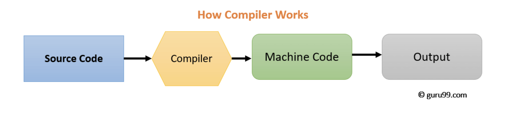
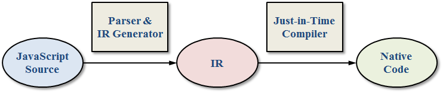
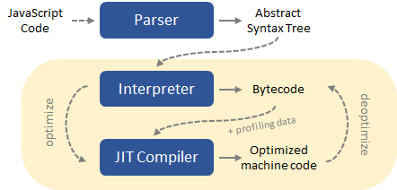

# How JavaScript Works Behind the Scenes

## 1. An High-Level Overview of JavaScript

자바스크립트는 고수준, 객체기반의 다중 패러다임 언어이다.

### 1-1. High-level

자바스크립트는 메모리를 직접 관리하는 저수준 언어와 달리 자동으로 메모리를 관리하는 고수준 언어이다.

### 1-2. Garbage-collection

자바스크립트에서 자동으로 메모리관리를 수행해주는 주체이다. 기본적으로 오래되고 사용하지 않는 객체를 자동으로 제거하는 자바스크립트 엔진 내부의 알고리즘이다.

### 1-3. Interpreted or just-in-time compiled

자바스크립트는 컴파일링이 자바스크립트 엔진을 통해 이루어진다.

### 1-4. Multi-paradigm

프로그래밍에서 패러다임이란 프로그래밍에 대한 관점 및 방법론을 의미한다. 다시말해서, 이는 코드 구조에 대한 접근법과 사고방식이며 프로그래머의 코딩 스타일과 기술을 지시한다. 프로그래밍 언어에는 절차적, 객체지향, 함수형 등의 패러다임이 존재한다. 많은 언어들이 한가지 패러다임을 갖는데에 반해 자바스크립트는 여러 패러다임을 갖는다. 그래서 매우 유연하고 다재다능하다.
자바스크립트의 객체 지향적인 특성에 대해 설명하자면, 자바스크립트는 프로토타입을 기반으로 하는 객체지향적 특성을 갖는다. 원시타입을 제외한 자바스크립트의 거의 모든것은 객체이다. 우리가 Array와 같은 객체를 생성하고 method를 사용할 수 있는것은 프로토타입 상속 덕분이다.

### 1-5. First-class functions

자바스크립트에서는 함수를 다른 일반적인 변수들처럼 다룰 수 있는데 이와같은 함수를 First-class functions라고 한다. First-class functions은 함수를 변수나 데이터구조 안에 담거나 다른 함수의 파라미터로 전달할 수 있고 반환값으로도 사용하는 등 여러 기능이 있다. First-class functions는 우리가 여러 기술을 사용할 수 있게할 뿐만 아니라 함수형 패러다임을 적용할 수 있도록 한다.

### 1-6. Dynamic

자바스크립트는 동적 타입 언어이다. 변수의 타입을 지정하지 않으며 변수에 값이 할당되는 과정에서 자바스크립트 엔진이 할당되는 값의 타입을 따라서 자동으로 변수의 타입을 결정한다. 이를 통해 우리는 한 변수에 여러타입의 값을 유연하게 할당할 수 있다.

### 1-7. Single-threaded

자바스크립트는 단일 스레드에서 실행되며 이로인해 일반적으로 실행시 한번에 한가지 작업만을 수행할 수 있다.

### 1-8. Non-blocking event loop

단일 스레드로 실행되는 자바스크립트에서 긴시간이 걸리는 작업을 수행할 때 다른 작업이 blocking 되는것을 방지하기 위해서 event-loop를 사용한다. 간단히 말하자면 자바스크립트는 Web APIs를 활용한 event loop를 통해서 시간이 오래 걸리는 작업을 background에서 실행되도록 하고 메인 스레드의 작업이 모두 끝나면 이를 다시 불러온다. 이를 event loop에 기반한 동시성 모델이라고 한다. 동시성 모델이란 단일 스레드 기반의 자바스크립트가 여러 작업을 마치 동시에 수행하는 것처럼 보이게 하는것이다.(실제로 동시에 수행되는 것이 아님.)

## 2. The JavaScript Engine and Runtime

자바스트립트 엔진은 간단하게 말해서 자바스크립트 코드를 컴파일하고 실행하는 프로그램이다. 모든 브라우저는 그들만의 자바스크립트 엔진을 지니고 있다. 그 중에서 가장 유명한 자바스크립트 엔진은 Google의 V8 엔진이다. V8엔진은 구글 크롬과 node.js에서 사용된다.

### 2-1. 자바스크립트 엔진의 구조

모든 자바스크립트 엔진은 콜스택과 힙을 포함하고 있다. 콜스택은 우리의 코드가 execution context를 사용하여 실제로 실행되는 곳이며 힙은 애플리케이션에 필요한 모든 객체를 저장하는 구조화되지 않은 메모리 영역이다.

### 2-2. 컴파일러와 인터프리터

(컴파일러)

(인터프리터)

(Just-in-time compilation)

컴파일러와 인터프리터는 프로그래밍 언어를 0과 1로 이루어진 기계어로 변환한다는 공통점을 지니고 있으나 그 과정에 있어서 차이점이 있다. 컴파일러는 전체 소스코드를 한번에 기계어로 변환하는 반면에 인터프리터는 한 행씩 변환하고 변환과 동시에 즉시 실행해나간다. 컴파일러는 실행 가능한 프로그램이 생성되는 반면 인터프리터는 번환과 동시에 실행되므로 별 다른 프로그램이 생성되지 않는다. 자바스크립트는 순전히 인터프리터 언어였다. 인터프리터 언어는 컴파일 언어보다 느리다는 단점이 있어서 현재 다수의 자바스크립트 엔진은 이 단점을 해결하기 위해 컴파일 방식과 인터프리터 방식을 혼용하고 있는데 이를 Just-in-time compilation이라고 한다. Just-in-time compilation은 컴파일러와 마찬가지로 전체 소스코드를 한번에 기계어로 변환하는데 이때 실행프로그램은 생성하지 않고 인터프리터처럼 변환 즉시 실행한다는 특징이 있다.

### 2-3. just-in-time compiler

자바스크립트 엔진이 자바스크립트 코드를 실행하는 일반적인 과정은 아래와 같다.

1. 소스코드 파싱 => AST(Abstract Syntax Tree) 생성. ( AST : 각 코드 행을 언어에대해 의미있는 조각들로 나눈 뒤 트리 구조로 저장한것이다. )
2. 생성된 AST를 머신코드로 변환.
3. 코드 실행. 실행은 콜스택에서 이루어진다.

위의 과정은 가능한 한 빨리 실행하기 위한 과정이다. 자바스크립트 엔진은 위과정에 추가로 JIT Compiler를 활용한 최적화를 수행한다. 최적화는 프로그램 실행중에 백그라운드에서 이루어지는데 최적화된 코드는 상황에 따라 다시 deoptimize 되기도 한다. 파싱, 컴파일, 최적화의 모든 과정은 우리가 접근할 수 없는 엔진 내의 특별한 스레드에서 수행된다. 즉, 실행을 위한 메인스레드와 완벽하게 분리된 스레드에서 수행되는 것이다.

### 2-4. Runtime in the browser

자바스크립트 런타임은 우리에게 필요한 자바스크립트와 연관된 모든 것들을 담고있는 상자라고 생각하면 된다. 즉, 자바스크립트로 작성된 코드가 구동되는 환경을 의미한다.(ex. Javascript engine, Web APIs, Callback queue)

Callback queue : 모든 실행 준비된 콜백함수( ex. event handler function )를 포함하는 자료구조. 콜스택이 비어있을 때 콜백큐에 있는 콜백함수가 콜스택으로 전달되고 그 결과 실행이 된다. 이런 과정을 event loop라고 한다.

## 3. Execution Contexts and The Call Stack
