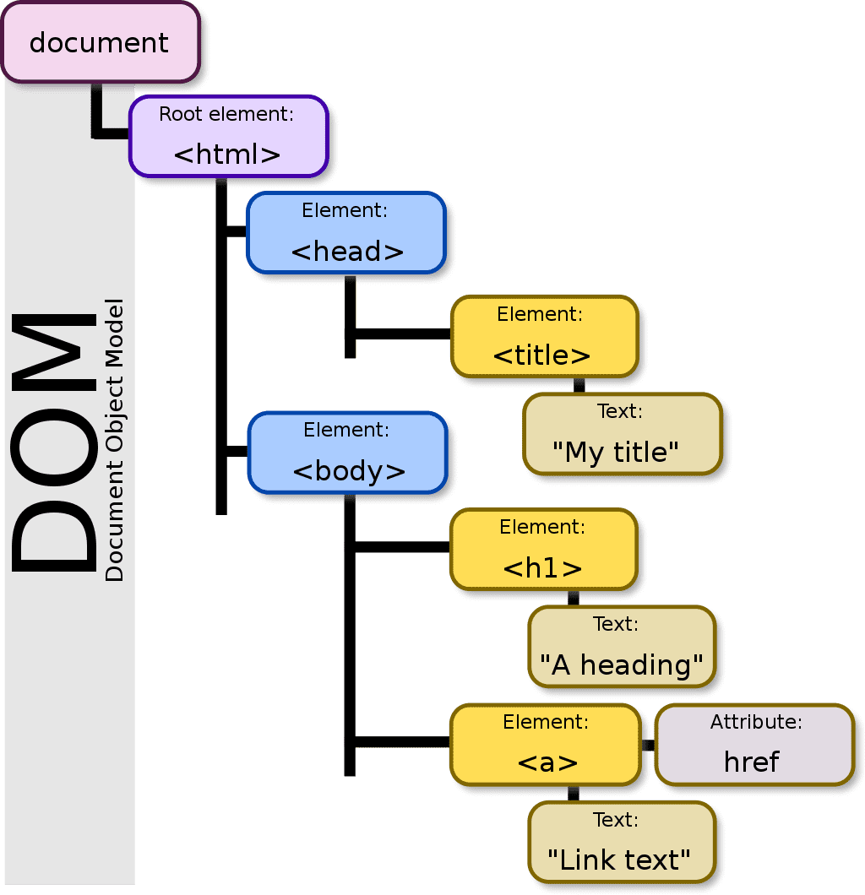

# JavaScript in the Browser: DOM and Events Fundamentals.

## 1. What's the DOM and DOM Manipulation

### 1-1. What is the DOM?

DOM(Document Object Model)은 HTML 문서의 구조화된 표현이다. DOM은 JavaScript가 HTML에 접근할 수 있도록 해주는 interface이다. (DOM은 HTML 문서를 JavaScript가 접근, 조작할 수 있는 형태로 Parsing하여 만들어진 결과물이다.) DOM은 HTML 페이지가 로드되는 즉시 브라우저에 의해 자동으로 생성되고 트리구조로 저장된다. 이 트리 안에서 각 HTML요소는 객체의 형태를 가진 하나의 node가 된다.


( DOM Tree )

### 1-1. DOM Manipulation.

Javascript에서 DOM에 접근할때는 항상 진입점인 document Object를 거친다.

- querySelector()

  CSS의 selector와 같은 문자열 값을 입력하면 해당하는 element에 접근 가능하다.

  ```js
  const myElement = document.querySelector(".message");
  ```

- classList

  element의 class 목록에 접근, add(), remove(), toggle()등의 method를 활용하여 class 목록을 동적으로 변경할 수 있다. 또한 contains()를 활용해 특정 클래스를 포함하고 있는지 여부를 알 수 있다.

  ```html
  <div class="modal hidden">modal</div>
  ```

  위와같은 element가 있다고 가정할 때 아래와 같은 스크립트를 실행하면,

  ```js
  document.querySelector(".modal").classList.remove("hidden");
  ```

  element의 class는 다음과 같이 변경된다.

  ```html
  <div class="modal">modal</div>
  ```

  element의 style을 동적으로 변경하고 싶을때, style 프로퍼티로 접근하여 이를 변경하는 방법도 있지만 style 속성이 여러개일때는 원하는 style을 class selector로 묶어서 작성하고 위와같이 classList를 활용하는 것이 좋다.

### 1-2. querySelector와 getElementsById의 차이.

우선 getElementsById의 속도가 더 빠르다. 하지만 인자로 id만을 사용할 수 있어서 범용성으로 따지자면 querySelector가 우세한 편이며 getElementsById의 속도가 빠르다는 것도 비교적 빠르다는 것 뿐이지 querySelector의 속도가 많이 느린것은 아니다.

### 1-3. querySelectorAll과 getElementsByClassName의 차이.

querySelectorAll은 인자로 주어진 속성값을 갖는 모든 요소를 NodeList로 반환하며 getElementsByClassName은 인자로 주어진 클래스명을 갖는 모든 요소를 HTMLCollection의 형태로 반환한다.

### 1-4. DOM에 대한 오해

- DOM은 HTML이다?

  DOM은 HTML로부터 생성되지만 이 둘은 다른것이다. 특정한 상황에서 DOM과 HTML문서가 다르게 나타나는 것으로 이를 알 수 있다.

- DOM은 Javascript언어의 한 요소이다?

  DOM은 Javascript의 요소가 아니라 Web API의 요소이다. WEB API에 Javascript로 작성된 DOM객체와 프로퍼티가 존재하는 것이다. 즉, Javascript는 Web API를 통해서 DOM에 접근하는 것으로 볼 수 있다.

## 2. Events

이벤트란 mouse click, mouse moving, key press등 page에서 발생하는 특정 사건을 의미한다. 우리는 event listener를 통해 특정 이벤트가 발생했을 때 이에 반응할 수 있다.

### 2-1. addEventListener()

아래와 같이 addEventListener method를 사용하여 element에 event listener를 추가할 수 있다. 이 method는 첫번째 parameter로 이벤트의 종류, 두번째 parameter로 event handler function을 받는다. event handler function에는 이벤트가 발생했을때 실행할 코드를 작성한다.

```js
const btn = document.querySelector(".check");
btn.addEventListener("click", function () {
  console.log("clicked!");
});
```

이렇게 이벤트 리스너를 추가하면 자바스크립트 엔진은 이벤트가 발생했을때 이벤트 핸들러 함수를 자동으로 호출한다.

### 2-2. 이벤트의 종류

- 마우스 이벤트

  click, dbclick, mousedown, mouseup, mouseover, mousemove 등이 있다.

- 키보드 이벤트

  keydown, keypress, keyup가 있다.

- 폼 이벤트

- 문서/창 이벤트

- 기타 이벤트

### 2-3. 이벤트 객체

자바스크립트 엔진은 이벤트가 발생하면 이벤트 객체를 생성하고 관련 정보를 저장한다. 이벤트 핸들러 함수에서 parameter를 지정하면 이벤트 객체가 해당 parameter의 argument가 되는데 이를 통해 이벤트 객체에 접근할 수 있다.

#### 예시

```js
document.addEventListener("keydown", (e) => {
  console.log(e); //KeyboardEvent {isTrusted: true, key: "d", code: "KeyD", location: 0, ctrlKey: false, …} 출력.
});
```
