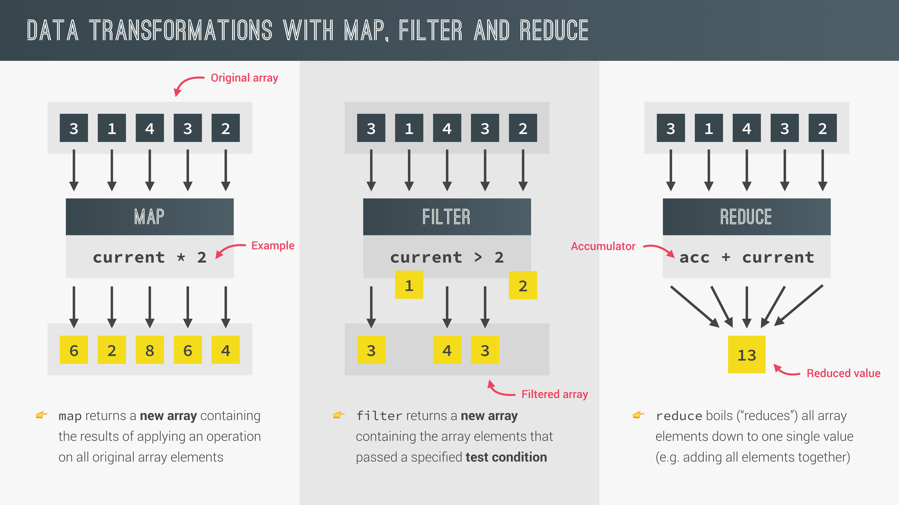

# Working With Arrays

## 1. Simple Array Methods

자바스크립트에서 배열은 객체이며, 내장 메소드를 가지고있다. 이런 메소드들은 MDN을 통해 살펴보는것을 추천한다.

### 1-1. slice

shallow copy를 수행하며, 배열의 일부분을 복사하여 반환한다. 파라미터는 시작인덱스와 끝인덱스이다. 끝인덱스-1 까지의 요소까지 복사된다는 것에 유의하자. 또한 인덱스의 값으로 - 값을 넣을수 있는데, 제일 끝 인덱스가 -1이다.

```js
let arr = ["a", "b", "c", "d", "e"];

console.log(arr.slice(2, 4)); // ["c","d"]
console.log(arr.slice(2)); // ["c","d","e"]
console.log(arr.slice(-2)); // ["d","e"]
console.log(arr.slice(1, -2)); // ["b","c"]
console.log(arr.slice()); // ["a","b","c","d","e"]
console.log([...arr]); // ["a","b","c","d","e"]
console.log(arr); // ["a","b","c","d","e"]
```

### 1-2. splice

slice와는 다르게 원본 배열의 요소가 제거되고 제거된 요소로 이루어진 배열을 반환한다. 파라미터로는 시작 인덱스와 제거할 요소의 갯수를 받는다.

```js
let arr = ["a", "b", "c", "d", "e"];

console.log(arr.splice(3)); // ["d","e"]
console.log(arr.splice(0, 2)); // ["a", "b"]
console.log(arr.splice(-1)); // ["c"]
console.log(arr); // []
```

### 1-3. reverse

배열의 요소 순서를 뒤집는다. 원본 배열에 적용된다.

```js
const arr2 = ["j", "i", "h", "g", "f"];

console.log(arr2.reverse()); // ["f","g","h","i","j"]
console.log(arr2); // ["f","g","h","i","j"]
```

### 1-4. concat

두 배열을 하나의 배열로 합쳐서 반환한다.

```js
const letters = arr.concat(arr2);

console.log(letters); // ["a", "b", "c", "d", "e", "f", "g", "h", "i", "j"]
console.log([...arr, ...arr2]); // ["a", "b", "c", "d", "e", "f", "g", "h", "i", "j"]
```

### 1-5. join

배열의 요소들 사이에 구분자를 넣어 문자열로 만들고 반환한다.

```js
console.log(letters.join(" - ")); // a - b - c - d - e - f - g - h - i - j
```

## 2. Looping Arrays: forEach

forEach 메소드는 고차함수로서 콜백함수를 argument로 받는다. 배열의 모든 요소를 순회하며 각 요소에 대해 콜백함수를 실행한다. 콜백함수에 파라미터를 지정하면 그 파라미터에는 현재 요소가 argument로 전달되게 된다.

```js
const movements = [200, 450, -400, 3000, -650, -130, 70, 1300];

movements.forEach((e) => {
  if (e > 0) {
    console.log(`You deposited ${e}`);
  } else {
    console.log(`You withdrew ${Math.abs(e)}`);
  }
});
```

콜백함수의 파라미터는 여러개 지정할수도 있는데 순서대로 value, index, array가 된다.

```js
movements.forEach((e, i) => {
  if (e > 0) {
    console.log(`Movement ${i + 1} : You deposited ${e}`);
  } else {
    console.log(`Movement ${i + 1} : You withdrew ${Math.abs(e)}`);
  }
});
```

forEach 메소드와 for of 문의 차이점은 forEach 메소드는 break, continue를 사용할 수 없다는 것이다.

## 3. forEach With Maps and Sets

forEach 메소드는 Map과 Set에도 사용할 수 있다. 배열의 forEach와는 조금 다른 부분이 있는데 우선 map의 forEach 콜백함수의 파라미터는 순서대로 value, key, map 이다. 다음으로 set의 forEach 콜백함수는 두번째 파라미터가 key가 아니라 value가 된다. 즉, 파라미터는 순서대로 value, value, set이다.

```js
//Map
const currencies = new Map([
  ["USD", "United States dollar"],
  ["EUR", "Euro"],
  ["GBP", "Pound sterling"],
]);

currencies.forEach((value, key, map) => {
  console.log(`${key} : ${value}`);
}); // USD : United States dollar / EUR : Euro / GBP : Pound sterling

//Set
const currenciesUnique = new Set(["USD", "GBP", "USD", "EUR", "EUR"]);

console.log(currenciesUnique); // Set(3) {"USD", "GBP", "EUR"}

currenciesUnique.forEach((value, value2, set) => {
  console.log(`${value} : ${value2}`);
}); // USD : USD / GBP : GBP / EUR : EUR
```

## 4. Data Transformations: map, filter, reduce

자바 스크립트에는 데이터 변환을 위해 주로 사용하는 중요한 3가지 Array 메소드가 있다. 이 메소드들은 주로 배열로부터 변환된 데이터를 갖는 새로운 배열을 생성한다. 해당하는 메소드는 바로 map, filter, reduce이다.



### 4-1. map

forEach와 같이 배열의 모든 요소를 순회한다. forEach와의 차이점은 기존 배열을 기반으로 새로운 배열을 생성한다는 것이다. 각각의 요소에 대해 콜백 함수를 실행하고 콜백 함수는 새로운 배열의 요소를 반환하며 결과적으로 map은 그 요소들로 이루어진 새로운 배열을 반환한다.

### 4-2. filter

이름 그대로 기존 배열의 요소를 특정 조건에 따라 필터링하는 메소드이다. map과 마찬가지로 새로운 배열을 반환한다.

### 4-3. reduce

배열의 모든 요소를 하나의 값으로 줄여서 반환한다. ( ex. 배열의 모든 요소의 합 ) accumulator와 순회할때 각각의 요소에 해당하는 current value를 사용한다. 활용도가 높다.

## 5. The map Method

map 메소드의 사용 예시를 살펴보자.

```js
const movements = [200, 450, -400, 3000, -650, -130, 70, 1300];
const eurToUsd = 1.1;

const movementsUSD = movements.map((e) => {
  return Math.floor(e * eurToUsd);
});

console.log(movements); // [200, 450, -400, 3000, -650, -130, 70, 1300]
console.log(movementsUSD); // [220, 495, -441, 3300, -716, -143, 77, 1430]
```

map을 이용해 movements의 각각의 요소에 1.1을 곱한 값을 요소로 갖는 movementsUSD라는 배열을 얻었다.

map 메소드는 forEach 메소드와 같은 파라미터를 지니고 있다. 순서대로 value, index, array이다.

```js
const movementsDescriptions = movements.map((e, i) => {
  return `Movement ${i + 1} : You ${
    e > 0 ? "deposited" : "withdrew"
  } ${Math.abs(e)}`;
});

console.log(movementsDescriptions); // ["Movement 1 : You deposited 200", "Movement 2 : You deposited 450", "Movement 3 : You withdrew 400", "Movement 4 : You deposited 3000", "Movement 5 : You withdrew 650", "Movement 6 : You withdrew 130", "Movement 7 : You deposited 70", "Movement 8 : You deposited 1300"]
```

## 6. The filter Method

filter 메소드는 배열의 각 요소를 순회하며 콜백 함수를 실행하고 콜백 함수의 반환값이 true일 때에 해당하는 요소들만으로 새로운 배열을 생성하여 반환한다. 콜백 함수의 파라미터는 map과 동일하다.

filter 메소드의 사용 예시를 보자.

```js
const movements = [200, 450, -400, 3000, -650, -130, 70, 1300];

const deposits = movements.filter((e) => e > 0);

console.log(deposits); // [200, 450, 3000, 70, 1300]
```

## 7. The reduce Method

reduce 메소드는 기본적으로 배열의 모든 요소를 하나의 값으로 축소시킨다. reduce 메소드의 콜백 함수가 지니는 파라미터는 map, filter와는 조금 다르다. 순서대로 accumulator, current value, index, array이다. accumulator는 값을 계속 축적한다. 마치 스노우 볼과도 같다. 배열의 각 요소를 순회하며 실행되는 콜백 함수가 반환하는 값은 다음 실행에 사용될 accumulator의 값이 된다. 그리고 reduce 메소드는 콜백 함수 말고도 하나의 파라미터를 더 지니고 있는데 이것은 accumulator의 초깃값이다.

아래 예시는 reduce 메소드를 활용하여 movements 배열의 모든 요소의 합을 구하는 예시다.

```js
const movements = [200, 450, -400, 3000, -650, -130, 70, 1300];

const balance = movements.reduce((acc, cur, i, arr) => {
  return acc + cur;
}, 0);

console.log(balance); // 3840.
```

또 다른 예시를 보자. 아래 예시는 reduce를 활용하여 movements 배열의 최댓값을 구하는 예시이다.

```js
const max = movements.reduce((acc, cur) => {
  if (cur > acc) {
    return cur;
  } else {
    return acc;
  }
}, movements[0]);

console.log(max);
```

## 8. The Magic of Chaining Methods

map, filter와 같은 메소드들은 배열을 반환한다는 점을 활용하여 아래와 같이 연결이 가능하다. 유용하지만 성능 저하를 일으킬 수 있으므로 과용하지는 말자. 또한 배열을 변형시키는 splice, reverse와 같은 메소드는 연결하지 않는 것이 좋다.

```js
const movements = [200, 450, -400, 3000, -650, -130, 70, 1300];
const eurToUsd = 1.1;

const totalDepositsUSD = movements
  .filter((e) => {
    return e > 0;
  })
  .map((e) => {
    return Math.floor(e * eurToUsd);
  })
  .reduce((acc, cur) => {
    return acc + cur;
  }, 0);
console.log(totalDepositsUSD); // 5522
```

## 9. The find Method

filter 메소드와 유사하나 새로운 배열을 생성해서 반환하는 것이 아니라 조건을 만족하는 첫번째 요소를 반환한다는 것에 차이점이 있다. 콜백 함수를 파라미터로 가짐.

```js
const movements = [200, 450, -400, 3000, -650, -130, 70, 1300];

const firstWithdrawal = movements.find((e) => e < 0);

console.log(firstWithdrawal); // -400
```

## 10. The findIndex Method

find 메소드와 유사하나 요소가 아닌 인덱스를 반환한다는 차이점이 있음. find와 마찬가지로 조건을 만족하는 첫번째 요소의 인덱스를 반환함. 콜백 함수를 파라미터로 가짐.

```js
const movements = [200, 450, -400, 3000, -650, -130, 70, 1300];

const index = movements.findIndex((e) => e < 0);

console.log(index); // 2
```

## 11. some and every

### 11-1. some

includes 와 유사하나 includes 로는 오직 주어진 값과 일치하는 요소가 있는지만을 알 수 있지만 some으로는 특정 조건을 만족하는 요소가 있는지에 대한 여부를 알 수 있다. 콜백 함수를 파라미터로 지니고 있다.

```js
const movements = [200, 450, -400, 3000, -650, -130, 70, 1300];

console.log(movements.includes(-130)); // true

const anyDeposits = movements.some((e) => e > 0);
console.log(anyDeposits); // true
```

### 11-2. every

some 메소드와 유사함. 모든 요소가 조건을 만족할때에만 true를 반환한다는 차이점이 있다.

```js
const movements = [200, 450, -400, 3000, -650, -130, 70, 1300];

console.log(movements.every((e) => e > 0)); // false
console.log(movements.filter((e) => e > 0).every((e) => e > 0)); // true
```

## 12. flat and flatMap

### 12-1. flat

중첩된 배열을 1차원 배열로 생성하여 반환해준다.

```js
const arr = [[1, 2, 3], [4, 5, 6], 7, 8];

console.log(arr.flat()); // [1,2,3,4,5,6,7,8]
```

Default로는 이차원 배열까지만 적용이 된다는 점을 알아두자.

```js
const arrDeep = [[[1, 2], 3], [4, [5, 6]], 7, 8];

console.log(arrDeep.flat()); // [[1, 2], 3, 4, [5, 6], 7, 8]
```

파라미터에 Depth 값을 전달하면 2차원 이상의 다차원 배열도 1차원 배열로 만들 수 있다. (Default 값은 1이다.)

```js
const arrDeep = [[[1, 2], 3], [4, [5, 6]], 7, 8];

console.log(arrDeep.flat(2)); // [1, 2, 3, 4, 5, 6, 7, 8]
```

### 12-2. flatMap

flatMap 은 flat과 map 메소드가 결합된 것이라고 볼 수 있다. 아래와 같은 코드가 있다고 한다면

```js
const overalBalance = accounts
  .map((e) => e.movements)
  .flat()
  .reduce((acc, cur) => acc + cur, 0);
```

아래와같이 flatMap으로 대체가 가능하다.

```js
const overalBalance = accounts
  .flatMap((e) => e.movements)
  .reduce((acc, cur) => acc + cur, 0);
```
