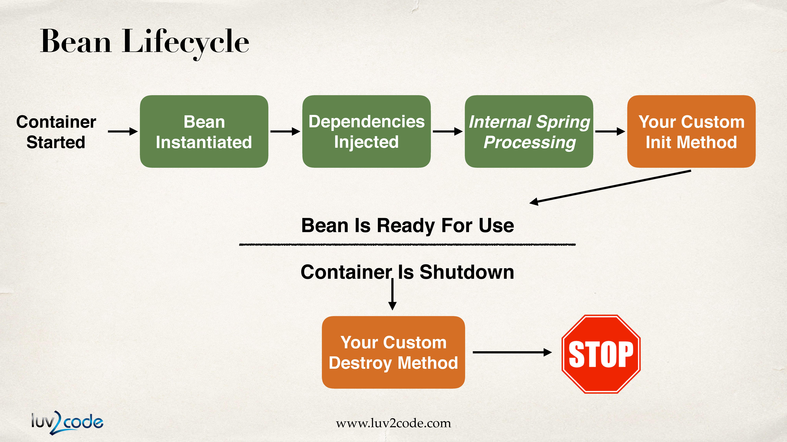

# Spring Bean Scopes and Lifecycle

## 1. Bean Scopes

Scope는 Bean의 생명주기를 가리킨다. 또한 아래와 같은 내용 또한 포함한다.

- Bean이 얼마나 오래 생존하는가

- 얼마나 많은 인스턴스가 생성되었는가

- Bean이 어떻게 공유되었는가

### 1-1. Default Scope : Singleton

Bean의 기본 Scope는 Singleton이다.

    Singleton?

     - Scope가 Singleton일때 Spring 컨테이너는 Bean의 인스턴스를 오직 하나만 생성하며 이는 메모리에 캐시된다.

     - Bean에 대한 모든 요청은 같은 Bean에 대한 공유된 참조를 반환한다.


### 1-2. Prototype Scope

Prototype Scope는 각각의 요청마다 새로운 인스턴스를 생성한다. Bean에 Prototype Scope를 적용하는 방법은 아래와 같다

```xml
<bean id="myCoach" class="com.example.springdemo.TrackCoach" scope="prototype">
<!--scope="prototype"으로 스코프 지정. -->
</bean>
```


## 2. Bean Lifecycle

### 2-1. Bean Lifecycle

Spring 컨테이너가 시작되면 아래와 같은 일들이 발생한다.



우리는 custom init method와 custom destroy method를 구성하고 Bean의 생명주기 내에서 이를 실행할 수 있다.

## 3. Bean Lifecycle Method / Hooks

- Bean의 초기화,소멸 중에 실행될 custom code를 추가할 수 있다.

  - Business logic 메소드 호출.

  - DB,Socket등의 자원을 다룰 Handle을 세팅.

즉, Spring은 Bean의 생명주기동안 Custom code를 호출할 수 있도록 해주는데 이를 Hooks라고 한다.

### 3-1. Init: method configuration

Bean의 초기화 중에 실행할 메소드는 아래와같이 설정할 수 있다.

```xml
<bean id="myCoach" class="com.example.springdemo.TrackCoach" init-method="doMyStartupStuff">
<!--init-method="method명"으로 지정. -->
</bean>
```

### 3-2. Destroy: method configuration

Bean의 소멸 중에 실행할 메소드는 아래와같이 설정할 수 있다.

```xml
<bean id="myCoach" class="com.example.springdemo.TrackCoach" destroy-method="doMyCleanupStuff">
<!--destroy-method="method명"으로 지정. -->
</bean>
```

### 3-3. Init, Destroy method 참고사항

- 접근지정자 : public, private, protected 사용가능

- 반환형 : 모든 타입을 반환형으로 지정 가능하지만 보통은 void를 지정한다.

- 인수(arguments) : 인수를 받을수 없다.

### 3-4. Destroy method와 prototype scope.

    Destroy method는 Bean이 prototype scope인 경우에는 호출되지 않는다. (Init method는 호출됨.)

    다른 scope와 다르게 prototype scope는 Spring이 전체 생명주기를 관리하지 않기 때문이다.

    prototype scoped Bean에 destroy method를 적용시키고 싶다면 해당 Bean이 DisposableBean 인터페이스를 구현하게한 후, destroy() method를 정의하면 된다.
