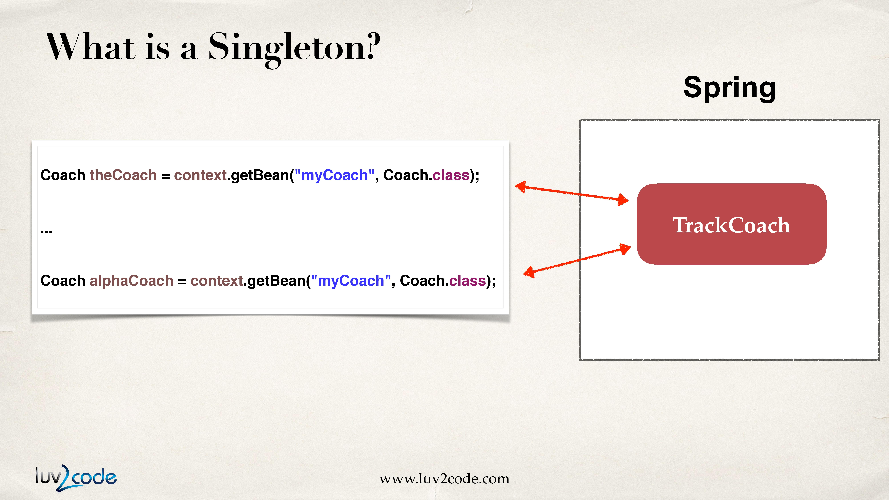
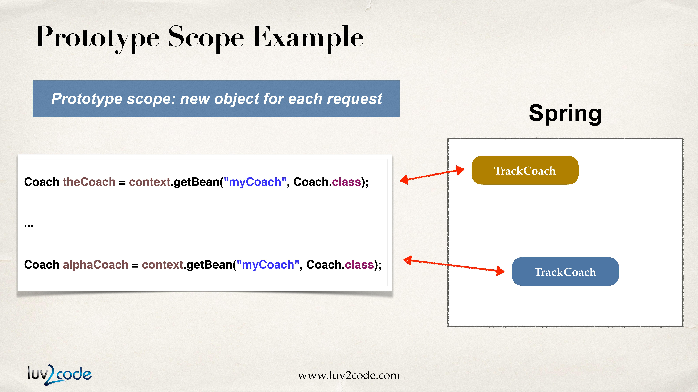

# Spring Bean Scopes and Lifecycle

## 1. Bean Scopes

Scope는 Bean의 생명주기를 가리킨다. 또한 아래와 같은 내용 또한 포함한다.

- Bean이 얼마나 오래 생존하는가

- 얼마나 많은 인스턴스가 생성되었는가

- Bean이 어떻게 공유되었는가

### 1-1. Default Scope : Singleton

Bean의 기본 Scope는 Singleton이다.

    Singleton?

     - Scope가 Singleton일때 Spring 컨테이너는 Bean의 인스턴스를 오직 하나만 생성하며 이는 메모리에 캐시된다.

     - Bean에 대한 모든 요청은 같은 Bean에 대한 공유된 참조를 반환한다.



### 1-2. Prototype Scope

Prototype Scope는 각각의 요청마다 새로운 인스턴스를 생성한다. Bean에 Prototype Scope를 적용하는 방법은 아래와 같다

```xml
<bean id="myCoach" class="com.example.springdemo.TrackCoach" scope="prototype">
<!--scope="prototype"으로 스코프 지정. -->
</bean>
```



## 2. Bean Lifecycle
