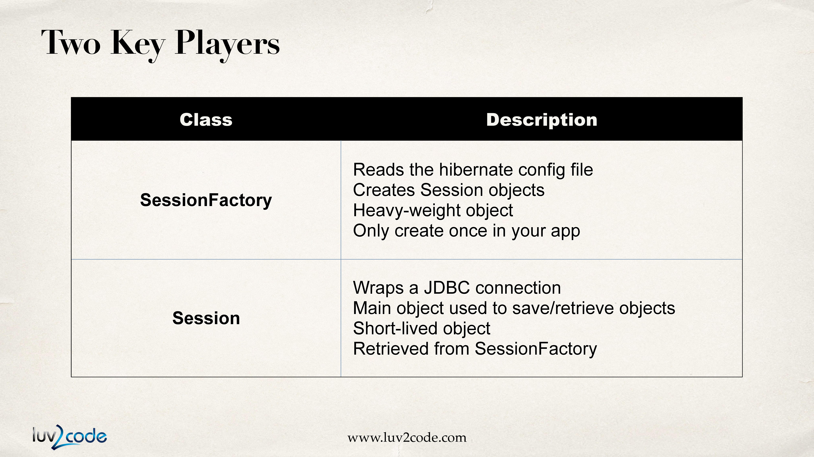
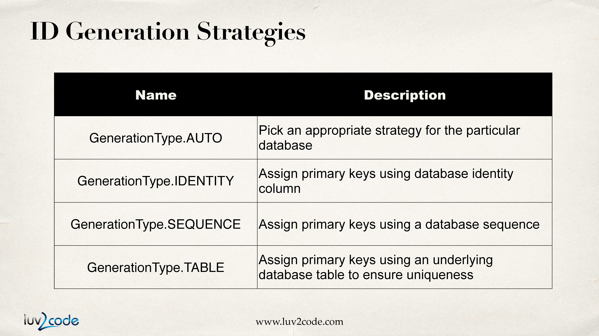

# Hibernate.

## 1. Hibernate?

Hibernate는 Java 객체를 데이터베이스에 저장,영속성을 부여하기위한 프레임워크이다.

### 1-1. Hibernate의 이점.

- Hibernate는 모든 low-level SQL을 수행해준다.

- 개발해야할 JDBC 코드의 양을 줄일수 있다.

- Hibernate는 ORM(Object-to-Relational Mapping)을 제공한다.

### 1-2. ORM

ORM이란 객체와 관계형 데이터베이스의 데이터를 자동으로 매핑해주는 것을 말한다. ORM을 사용하여 객체를 통해 간접적으로 데이터베이스의 데이터를 다룰 수 있다.

### 1-3. Saving a Java Object with Hibernate.

아래와같이 자바 객체를 생성하고 Hibernate의 특별한 객체인 session을 사용해서 객체를 데이터베이스에 저장할 수 있다.

```java
//자바 객체 생성
Student theStudent = new Student("John","Doe","john@luv2code.com");

//데이터베이스에 저장, save 메소드는 PK를 반환한다.
int theId = (Integer)session.save(theStudent);
```

### 1-4. Retrieving a Java Object with Hibernate

위와 마찬가지로 Hibernate의 session 객체를 통해서 데이터베이스의 데이터를 가져오는 것이 가능하다. 이때, get 메소드는 객체를 반환한다.

```java
// PK를 사용하여 데이터베이스에서 데이터를 가져온다.
Student myStudent = session.get(Student.class, theId);
```

### 1-5. Querying for Java Objects

아래와 같은 코드를 사용하여 데이터베이스에서 특정 테이블의 모든 데이터를 객체 리스트로 반환받을 수 있다. 아래 예시에서 "from Student"는 Hibernate Query Language (HQL)라고 한다.

```java
Query query = session.createQuery("from Student");

List<Student> students = query.list();
```

### 1-6. Hibernate and JDBC

Hibernate는 데이터베이스와 연동하기 위해 JDBC를 사용한다. 즉, Hibernate API를 사용해서 데이터베이스와 연동을 한다고해도 내부에서는 항상 JDBC API를 사용하고있다.

### 1-7. setting JDBC with Mysql.

gradle의 경우 build.gradle에 아래처럼 의존성을 추가해주면 JDBC를 통한 Mysql 데이터베이스와의 연결이 가능하다.

```gradle
implementation group: 'mysql', name: 'mysql-connector-java', version: '8.0.25'
```

## 2. Hibernate Configuration with Annotations

Hibernate를 사용하기 위한 과정은 아래와 같다.

1. Hibernate Configuration File 추가

2. 자바 클래스에 annotation 추가.

3. DB 작업을 위한 자바 코드 작성.

### 2-1. Creating the Hibernate Configuration File

build.gradle에 아래처럼 의존성을 주입.

```gradle
implementation group: 'org.hibernate', name: 'hibernate-entitymanager', version: '5.5.0.Final'
```

src/main 폴더에 아래 hibernate.cfg.xml파일 추가

```xml
<!DOCTYPE hibernate-configuration PUBLIC
        "-//Hibernate/Hibernate Configuration DTD 3.0//EN"
        "http://www.hibernate.org/dtd/hibernate-configuration-3.0.dtd">

<hibernate-configuration>

    <session-factory>

        <!-- JDBC Database connection settings -->
        <property name="connection.driver_class">com.mysql.cj.jdbc.Driver</property>
        <property name="connection.url">jdbc:mysql://localhost:3306/hb_student_tracker?useSSL=false&amp;serverTimezone=Asia/Seoul</property>
        <property name="connection.username">hbstudent</property>
        <property name="connection.password">hbstudent</property>

        <!-- JDBC connection pool settings ... using built-in test pool -->
        <property name="connection.pool_size">1</property>

        <!-- Select our SQL dialect -->
        <property name="dialect">org.hibernate.dialect.MySQLDialect</property>

        <!-- Echo the SQL to stdout -->
        <property name="show_sql">true</property>

		<!-- Set the current session context -->
		<property name="current_session_context_class">thread</property>

    </session-factory>

</hibernate-configuration>
```

### 2-2. Annotate Java Class

Hibernate에는 Entity class 라는 개념이 있다. Entity class란 데이터베이스의 테이블과 매핑된 자바 클래스를 의미한다.

매핑을 하는 방법에는 XML과 annotation 두가지가 있다. 여기서는 annotation을 사용해 매핑을 해보도록 한다.

매핑을 하는 과정은 아래와 같다.

1. 클래스를 테이블과 매핑. @Entity annotation으로 클래스를 Entity Class로 지정하고 @Table annoatation으로 특정 테이블과 클래스를 매핑시킨다.

```java
@Entity
@Table(name="student")
public class Student{
    ...
}
```

2. 필드를 컬럼과 매핑. @Id는 primary key임을 의미하며 @Column은 데이터베이스의 특정 컬럼을 지정한다.

```java
@Entity
@Table(name="student")
public class Student{
    @Id
    @Column(name="id")
    private int id;

    @Column(name="first_name")
    private String firstName;
    ...
}
```

## 3. Hibernate CRUD Features

CRUD에 대한 설명에 앞서 짚고 넘어가야할 두가지 객체가 있다.

- SessionFactory

  - hibernate config file을 읽는다.

  - Session 객체를 생성한다.

  - Heavy-weight 객체이다.

  - application에서 오직 한번 생성하고 필요할때마다 재사용한다.

- Session

  - JDBC connection을 Wrap한다.

  - 객체를 저장하고 받아오는데에 주로 쓰이는 객체이다.

  - Short-lived 객체이다. (작업을 수행할때마다 생성하여 사용하고 작업을 마치면 버린다.)

  - SessionFactory 객체로부터 얻어진다.



### 3-1. Creating and Saving Java Objects

1. Java Code Setup.

```java
public static void main(String[] args) {

        SessionFactory factory = new Configuration().configure("hibernate.cfg.xml").addAnnotatedClass(Student.class).buildSessionFactory();

        Session session = factory.getCurrentSession();

        try{

        } catch (Exception e) {
            e.printStackTrace();
        }finally {
            factory.close();
        }

    }
```

2. Save Java Object.

```java
try{
        // student 객체 생성
        Student tempStudent = new Student("Paul","Wall","paul@gmail.com");

        // 트랜잭션 시작
        session.beginTransaction();

        // student 객체 저장
        session.save(tempStudent);

        // 트랜잭션 커밋
        session.getTransaction().commit();

    } catch (Exception e) {

        e.printStackTrace();

    }finally {

        factory.close();

    }
```

이렇게 만들어진 어플리케이션을 실행하면 student 테이블에 컬럼 값으로 "Paul","Wall","paul@gmail.com"을 가진 행이 추가된다.

### 3-2. Primary Keys

Primary Key란?

    각 행을 고유하게 식별할 수 있도록 해주는 컬럼. 값은 유일해야하며 Null이어서는 안된다.

@Id 어노테이션으로 클래스내의 특정 필드를 Primary key임을 명시하고 데이터베이스에 이를 생성하도록 맡긴다.

```java
@Entity
@Table(name="student")
public class Student{
    @Id
    @Column(name="id")
    private int id;

    ...
}
```

또한 생성하는 방식을 @GeneratedValue(strategy=GenerationType)으로 hibernate에게 넘김으로써 해당 방식으로 Primary key를 생성하도록 할 수도 있다.

```java
@Entity
@Table(name="student")
public class Student{

    @Id
    @GeneratedValue(strategy=GenerationType.IDENTIFY)
    @Column(name="id")
    private int id;

    ...
}
```

Generation Strategie에는 아래와 같은 것들이 있다.



추가적으로 사용자 정의 Generation Strategie를 사용할 수도 있다.

1. org.hibernate.id.IdentifierGenerator 인터페이스를 구현.

2. public Serializable generate() 메소드를 오버라이딩. 해당 메소드에 business logic을 작성한다.

### 3-3. Reading Objects with Hibernate

아래와 같이 데이터베이스에서 Java 객체를 얻을 수 있다. session.get()을 통해 조회하는 데이터가 존재하지 않는다면 null을 반환한다.

```java
// 자바 객체 생성
Student theStudent = new Student("Daffy","Duck","daffy@gmail.com");

// 데이터 베이스에 저장
session.save(theStudent);

// primary key를 이용해서 데이터베이스 조회, 자바 객체를 얻음.
Student myStudent = session.get(Student.class, theStudent.getId());

```

예시

```java
public class ReadStudentDemo {

    public static void main(String[] args) {

        SessionFactory factory = new Configuration().configure("hibernate.cfg.xml").addAnnotatedClass(Student.class).buildSessionFactory();

        Session session = factory.getCurrentSession();

        try{
            // student 객체 생성
            Student tempStudent = new Student("Daffy","Duck","daffy@gmail.com");

            // 트랜잭션 시작
            session.beginTransaction();

            // student 객체 저장
            session.save(tempStudent);

            // 트랜잭션 커밋
            session.getTransaction().commit();

            // 새로운 세션을 얻는다.
            session = factory.getCurrentSession();

            // 트랜잭션 시작.
            session.beginTransaction();

            // primary key를 이용해 Student 객체를 얻음.
            Student myStudent = session.get(Student.class, tempStudent.getId());

            // 트랜잭션 커밋.
            session.getTransaction().commit();

        } finally {
            factory.close();
        }

    }
}
```

### 3-4. Querying Objects with Hibernate

    HQL

    - 객체를 얻어오기 위한 query lanquage

    - SQL과 유사하다.(where, like, order by, join, in, etc...)

아래는 Student 테이블의 모든 데이터를 객체로 얻는 예시이다. from Student에서 Student는 클래스 이름이다. 아래와 같은 쿼리를 작성하면 데이터베이스에서 모든 Student 객체를 얻어오게 된다.

```java
List<Student> theStudents = session.createQuery("from Student").getResultList();
```

아래는 where 절을 사용한 예시들이다.

```java
List<Student> theStudents = session.createQuery("from Student s where s.lastName='Doe'").getResultList();
```

```java
List<Student> theStudents = session.createQuery("from Student s where s.lastName='Doe'"+"OR s.firstName='Daffy'").getResultList();
```

```java
List<Student> theStudents = session.createQuery("from Student s where"+"s.email LIKE '%gmail.com'").getResultList();
```

### 3-5. Updating Objects with Hibernate

session 객체를 통해 얻어온 Entity객체의 field를 setter로 변경하고 트랜잭션을 커밋하면 데이터베이스에 자동으로 반영된다.

```java
int studentId = 1;
Student myStudent = session.get(Student.class, studentId);

// first name을 "Scooby"로 update.
myStudent.setFirstName("Scooby");

//트랜잭션 커밋
session.getTransaction().commit();
```

또는 아래와같이 update를 수행할 수도 있다.

```java
session.createQuery("update Student set email='foo@gmail.com'").excuteUpdate();
```

### 3-6. Deleting Objects with Hibernate

아래와 같이 데이터베이스에서 특정 객체와 매핑되는 데이터를 삭제할 수 있다.

```java
int studentId = 1;

Student myStudent = session.get(Student.class,studentId);

//Student 삭제.
session.delete(myStudent);

//트랜잭션 커밋.
session.getTransaction().commit();
```

아래와 같이 삭제를 수행할 수도 있다.

```java
session.createQuery("delete from Student where id=2").executeUpdate();
```
