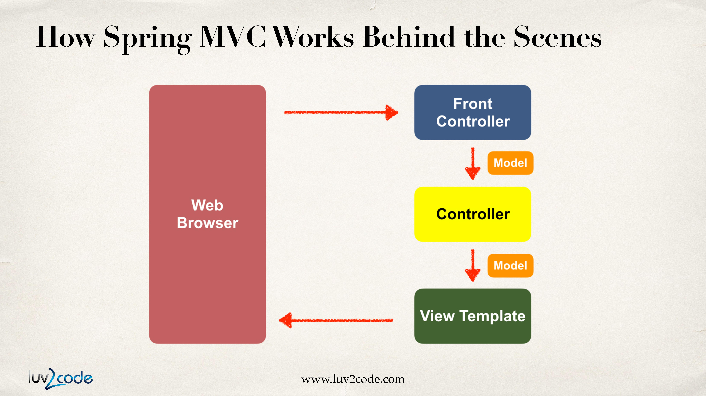
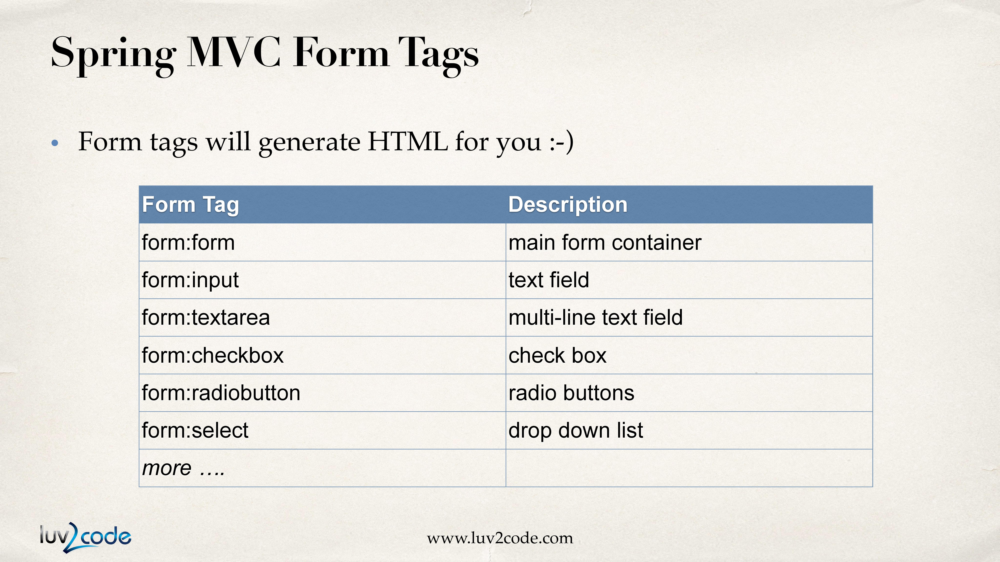
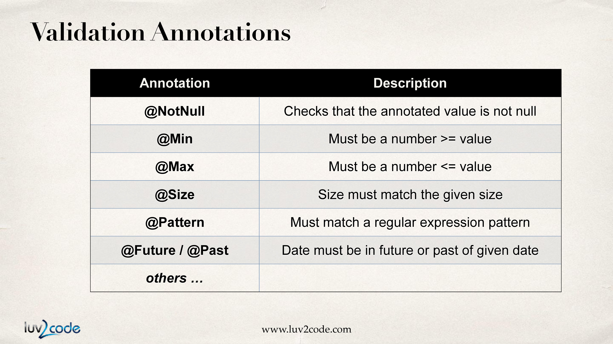

# Spring MVC

## 1. What is Spring MVC?

- 자바에서 웹 어플리케이션을 만들기위해 사용하는 프레임워크.

- Model-View-Controller 디자인패턴을 기반으로 한다.

- Core Spring 프레임워크의 기능을 활용한다.(IoC,DI)

## 2. Components of a Spring MVC Application

- UI 컴포넌트의 레이아웃을 위한 웹 페이지의 집합.

- Spring bean의 집합.

- Spring configuration.

## 3. How Spring MVC Works Behind the Scenes.



### 3-1. Front Controller

모든것은 브라우저로부터 요청이 들어오면서 시작되고 front controller라는 것을 만나게 된다.

- Front Controller는 DispatcherServlet이라고 알려져 있다. 요청을 시스템 내의 다른 객체나 요소들에게 위임하는 일을 한다.

  - Spring 프레임 워크의 한 부분이다.

  - Spring 개발 팀에 의해 이미 개발되어 있다.

- 우리가 개발해야 할 것

  - Model objects

  - View templates

  - Controller classes

### 3-2. Controller

- 개발자가 작성해야 하는 부분.

- business 로직을 포함한다.

  - 요청을 다룬다.

  - 데이터를 저장하거나 가져온다.

  - 데이터를 model에 위치시킨다.

- 데이터를 포함하고 있는 model을 적절한 view template으로 보낸다.

### 3-3. Model

- 데이터를 포함하고 있다.

- backend 시스템을 통해 데이터를 저장하거나 가져온다.

  - DB, web service, etc...

  - 원한다면 Spring bean을 사용한다.

### 3-4. View Template

- Spring MVC는 유연하다.

  - 다양한 view template을 지원한다.

- 가장 일반적인 것은 JSP + JSTL이다.

- 개발자는 페이지를 만들고 그 페이지를 통해 사용자에게 데이터를 보여준다.

## 4. Spring MVC Configuration

- web.xml에 내용 추가.

1. Spring MVC의 Dispatcher Servlet 구성.

file: web.xml

```xml
<web-app>

    <servlet>
        <servlet-name>dispatcher</servlet-name>
        <servlet-class>org.springframework.web.servlet.DispatcherServlet</servlet-class>

        <init-param>
            <param-name>contextConfigLocation</param-name>
            <param-value>/WEB-INF/spring-mvc-demo-servlet.xml</param-value>
        </init-param>

        <load-on-startup>1</load-on-startup>
    </servlet>

</web-app>
```

2. Dispatcher Servlet에 URL 매핑 설정.

file: web.xml

```xml
<web-app>

    <servlet>
        <servlet-name>dispatcher</servlet-name>
        <servlet-class>org.springframework.web.servlet.DispatcherServlet</servlet-class>
        ...
    </servlet>

    <servlet-mapping>
        <servlet-name>dispatcher</servlet-name>
        <url-pattern>/</url-pattern>
    </servlet-mapping>

</web-app>
```

3. Spring component scanning을 위한 부분 추가.

file: spring-mvc-demo-servlet.xml

```xml
<beans>
    <context:component-scan base-package="com.example"/>
</beans>
```

4. conversion, formatting, validation을 위한 부분 추가.

file: spring-mvc-demo-servlet.xml

```xml
<beans>
    <context:component-scan base-package="com.example"/>

    <mvc:annotation-driven/>
</beans>
```

4. Spring MVC View Resolver 구성.

file: spring-mvc-demo-servlet.xml

```xml
<beans>
    <context:component-scan base-package="com.example"/>

    <mvc:annotation-driven/>

    <bean class="org.springframework.web.servlet.view.InternalResourceViewResolver">
        <property name="prefix" value="/WEB-INF/view/"/>
        <property name="suffix" value=".jsp"/>
    </bean>
</beans>
```

## 5. Creating a Spring Home Controller and View

1. Controller 클래스 생성. @Controller annotation은 기본적으로 해당 클래스가 Spring MVC controller임을 명시. 또한 @Controller는 @Component를 상속받음. 따라서 scanning을 지원함.

```java
@Controller
public class HomeController{

}
```

2. Controller method 정의.

```java
@Controller
public class HomeController{

    public String showMyPage(){
        ...
    }

}
```

3. Controller method에 Request Mapping 추가.

```java
@Controller
public class HomeController{

    @RequestMapping("/")
    public String showMyPage(){
        ...
    }

}
```

4. View 이름을 반환.

```java
@Controller
public class HomeController{

    @RequestMapping("/")
    public String showMyPage(){
        return "main-menu";
    }

}
```

5. View Page 생성.
   file: /WEB-INF/view/main-menu.jsp

```html
<%@ page contentType="text/html;charset=UTF-8" language="java" %>
<html>
  <head>
    <title>Hello Spring MVC!</title>
  </head>
  <body>
    <h2>Spring MVC Demo - Home Page</h2>
  </body>
</html>
```

## 6. Adding Data to the Spring Model

### 6-1. Spring Model

- Model은 application data를 위한 컨테이너이다.

- Controller에서 Model로 무엇이든 넣을 수 있다. (String, Object, info from DB, etc...)

- View page(JSP)에서 model의 데이터에 접근할 수 있다.

### 6-2. 예시

1. Model을 Controller에 전달.

   Controller method에 Model 파라미터를 추가하고 Model.addAttribute("이름",값) 을 통해 Model에 데이터를 담을 수 있다.

```java
@RequestMapping("/processFormVersionTwo")
public String letsShoutDude(HttpServletRequest request, Model model){

    String theName = request.getParameter("studentName");

    theName = theName.toUpperCase();

    String result = "Yo! " + theName;

    model.addAttribute("message",result);

    return "helloworld";
}
```

2. View Template -JSP

   JSP에서 ${}안에 Controller method에서 넘긴 Model의 데이터 이름을 작성하여 접근할 수 있다

```html
<html>
  <body>
    Hello World of Spring!<br />
    ...<br />
    The message: ${message}
  </body>
</html>
```

## 7. Binding Request Params

@RequestParam annotation을 통해서 HTML form data를 변수에 바인딩할 수 있다. 아래 예시에서는 @RequestParam("studentName")을 통해 studentName에 해당하는 request 파라미터를 얻어와 theName 변수에 바인딩한다.

```java
@RequestMapping("/processFormVersionTwo")
public String letsShoutDude(@RequestParam("studentName") String theName, Model model){
    ...
}
```

## 7. Controller Level Request Mapping

Controller에 @RequestMapping 어노테이션을 적용할 수 있다. 모든 Controller method의 mapping 앞에 Controller의 mapping이 적용된다. ex. showForm()의 경우 /funny/showForm

```java
@RequestMapping("/funny")
public class FunnyController{
    @RequestMapping("/showForm")
    public String showForm(){
        ...
    }
    @RequestMapping("/processForm")
    public String process(HttpServletRequest request, Model model){

    }
}
```

이와 같은 방식은 Mapping이 충돌하는 상황을 해결하는데 도움을 준다.

## 8. Spring MVC Form Tags

Spring MVC Form Tags는 웹페이지의 일부로써 구성 및 재사용이 가능하다. 또한 data binding을 가능하게 하여 자동적으로 data를 세팅하거나 Java 객체 또는 bean에서 데이터를 가져올 수 있다.



### 8-1. How To Reference Spring MVC Form Tags

Spring MVC Form Tags를 참조하기 위해서는 JSP 파일의 첫부분에 Spring 네임스페이스를 지정해야 한다.

```jsp
<%@ taglib prefix="form" uri="http://www.springframework.org/tags/form" %>
```

### 8-2. Text Fields

1. Form을 사용하는 페이지 요청과 매핑된 컨트롤러를 아래와 같이 작성. addAttribute를 통해서 비어있는 객체를 Model에 추가한다.

```java
@RequestMapping("/showForm")
public String showForm(Model theModel){

    theModel.addAttribute("student",new Student());

    return "student-form";
}
```

2. Form을 사용하는 페이지 작성. form:input의 path는 Spring에서 submit시에는 setFirstName, 데이터를 가져다 쓸 때는 getFirstName이 수행되는데 이처럼 setter, getter명에 사용된다.

```html
<form:form action="processForm" modelAttribute="student">
  First name : <form:input path="firstName" />

  <br />

  Last name : <form:input path="lastName" />

  <br />

  <input type="submit" value="Submit" />
</form:form>
```

3. form tag에 입력된 값을 getter를 통해 얻어올 수 있다. 이때 파라미터의 @ModelAttribute("student") 어노테이션을 통해 Model의 student attribute가 Student 객체 theStudent에 자동으로 바인딩된다.

```java
@RequestMapping("/processForm")
public String processForm(@ModelAttribute("student") Student theStudent){

    System.out.println("theStudent : " + theStudent.getLastName());

    return "student-confirmation";
}
```

4. Form을 통해 얻은 데이터를 보여줄 페이지 작성.

```html
<html>
  <body>
    The student is confirmed : ${student.firstName} ${student.lastName}
  </body>
</html>
```

### 8-3. form:select

1. JSP 페이지 form안에 아래와 같은 form:select 태그를 작성. value는 코드내의 값이 될 것이며 label은 셀렉트박스에 보여지는 항목 이름이 될 것이다. path는 위에서 배운것과 동일.

```html
<form:select path="country">
  <form:option value="Brazil" label="Brazil" />
  <form:option value="France" label="France" />
  <form:option value="Germany" label="Germany" />
  <form:option value="India" label="India" />
</form:select>
```

2. map을 활용하면 아래와 같이 태그를 간단하게 작성할 수 있다. map의 key가 바인딩되는 값이 되며 value가 셀렉트박스에 보여지는 label이 된다.

```java
public class Student {

    private String firstName;
    private String lastName;
    private String country;

    private LinkedHashMap<String,String> countryOptions;

    public Student(){
        countryOptions = new LinkedHashMap<>();

        countryOptions.put("BR","Brazil");
        countryOptions.put("FR","France");
        countryOptions.put("DE","Germany");
        countryOptions.put("IN","India");
        countryOptions.put("US","United States of America");
    }
    ...
}
```

```html
<form:select path="country">
  <form:option items="${student.countryOptions}" />
</form:select>
```

### 8-4. form:radiobutton

form:radiobutton 태그의 사용법은 아래와 같다.

```html
Java<form:radiobutton path="favoriteLanguage" value="Java" /><br />
C#<form:radiobutton path="favoriteLanguage" value="C#" /><br />
PHP<form:radiobutton path="favoriteLanguage" value="PHP" /><br />
Ruby<form:radiobutton path="favoriteLanguage" value="Ruby" />
```

select 태그와 마찬가지로 맵을 활용하면 아래와 같이 사용할 수도 있다.

```java
public class Student {

    private LinkedHashMap<String,String> favoriteLanguageOptions;

    public Student(){
        favoriteLanguageOptions = new LinkedHashMap<>();
        // parameter order: value, display label
        favoriteLanguageOptions.put("Java", "Java");
        favoriteLanguageOptions.put("C#", "C#");
        favoriteLanguageOptions.put("PHP", "PHP");
        favoriteLanguageOptions.put("Ruby", "Ruby");
    }
    ...
}
```

```html
<form:radiobuttons
  path="favoriteLanguage"
  items="${student.favoriteLanguageOptions}"
/>
```

### 8-5. form:checkbox

form:checkbox 태그의 기본적인 사용법은 아래와 같다.

```html
Linux <form:checkbox path="operatingSystems" value="Linux" /><br />
Mac OS <form:checkbox path="operatingSystems" value="Mac OS" /><br />
MS Windows <form:checkbox path="operatingSystems" value="MS Windows" />
```

submit시에 체크된 value 값들을 operatingSystems라는 문자열 배열에 바인딩되도록 field와 getter,setter를 세팅한다.

```java
public class Student {

    ...

    private String[] operatingSystems;

    ...

    public String[] getOperatingSystems() {
        return operatingSystems;
    }

    public void setOperatingSystems(String[] operatingSystems) {
        this.operatingSystems = operatingSystems;
    }

    ...
}
```

JSTL을 사용하여 페이지에 데이터를 나타낸다.

```html
... <%@ taglib uri="http://java.sun.com/jsp/jstl/core" prefix="c" %> ...

<ul>
  <c:forEach var="temp" items="${student.operatingSystems}">
    <li>${temp}</li>
  </c:forEach>
</ul>
```

## 9. Spring MVC Form Validation

Validation이란 데이터의 값이 유효한지 확인하는 것을 의미한다. Spring 4 이상부터 이런 유효성 검증을 위한 Bean Validation API를 지원하고 있다. 아래는 유효성 검증에 사용되는 어노테이션이다.



### 9-1. Required Fields

1. 검증 규칙을 클래스에 추가.(@NotNull, @Size)

```java
public class Customer{
    private String firstName;

    @NotNull(message="is required")
    @Size(min=1, message="is required")
    private String lastName;
    ...
}
```

2. HTML form에서 에러 메시지를 보여준다. (<form:errors path="lastName" cssClass="error" />)

```html
<form:form action="processForm" modelAttribute="customer">
  First name : <form:input path="firstName" />
  <br />
  Last name (*) : <form:input path="lastName" />
  <form:errors path="lastName" cssClass="error" />
  <br />
  <input type="submit" value="Submit" />
</form:form>
```

3. Controller 클래스에서 검증 수행. 예시를 보면 @Valid로 Customer 객체에 검증을 수행하게하고 그 검증 결과는 BindingResult 객체에 담기게된다. 즉, Spring은 해당 메소드가 호출되면 검증을 수행하고 그 검증결과는 BindingResult 객체에 담기는 것.

```java
@RequestMapping("/processForm")
public String processForm(@Valid @ModelAttribute("customer") Customer theCostomer, BindingResult theBindingResult){

    if(theBindingResult.hasErrors()){
        return "customer-form";
    }
    else{
        return "customer-confirmation";
    }
}
```

4. 결과 페이지 작성.

```html
<html>
  <body>
    The customer is confirmed: ${customer.firstName} ${customer.lastName}
  </body>
</html>
```
